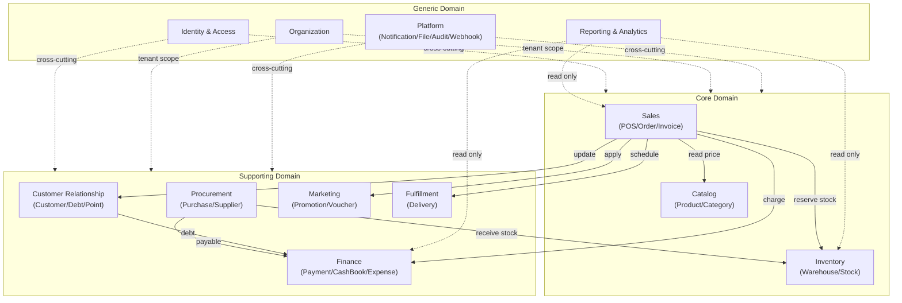
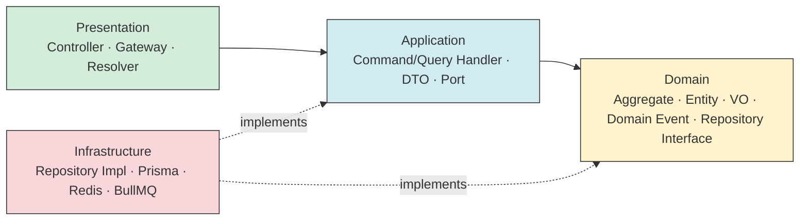
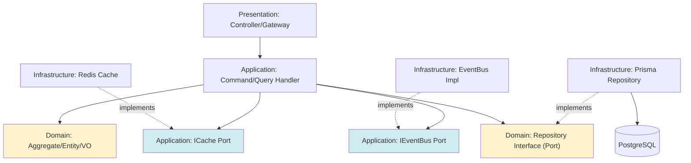
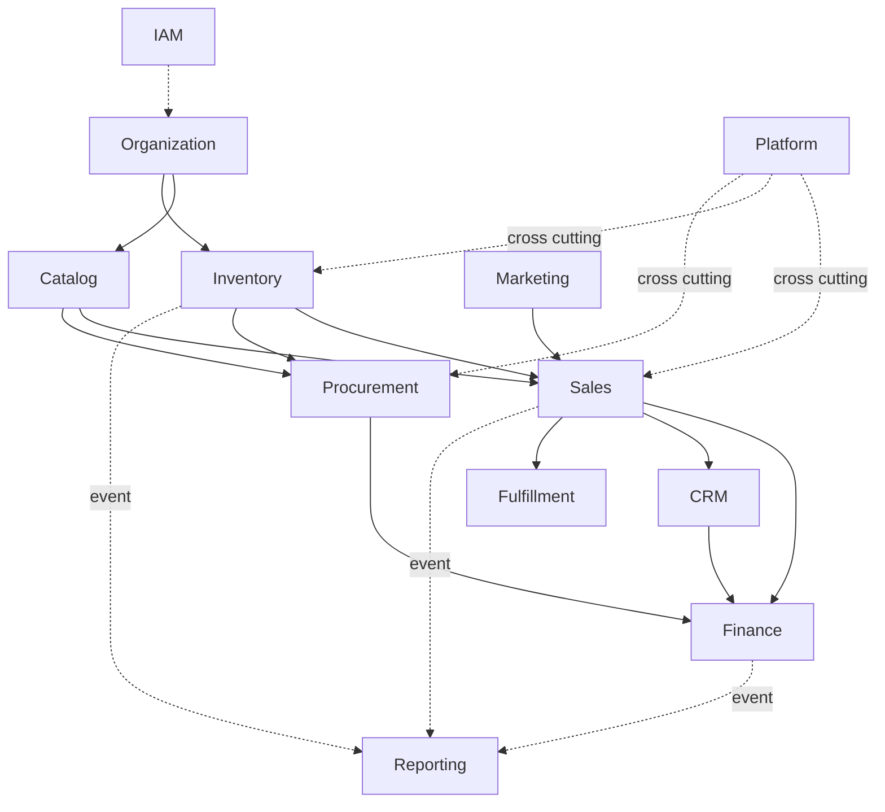
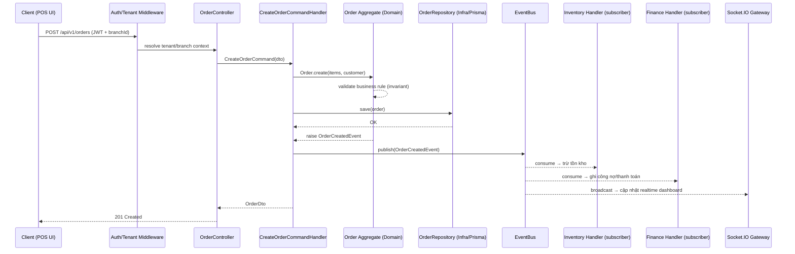

# POS ERP Enterprise v1.0 — Tài liệu Kiến trúc Tổng thể

**Prompt:** 001 — Thiết kế kiến trúc
**Trạng thái:** Draft v1.0
**Phạm vi:** Toàn hệ thống (Backend + Frontend + Data + Communication)
**Không chứa code.** Tài liệu này là nguồn tham chiếu bắt buộc cho mọi prompt từ 002 trở đi. Không prompt nào được phép tự ý thay đổi các quyết định kiến trúc dưới đây — mọi thay đổi phải được ghi nhận như một ADR (Architecture Decision Record) bổ sung.

---

## 0. Nguyên tắc nền tảng

| Nguyên tắc | Cách áp dụng |
|---|---|
| **Clean Architecture** | 4 lớp đồng tâm: Domain → Application → Infrastructure → Presentation. Phụ thuộc luôn hướng vào trong (Dependency Rule). Domain không biết gì về framework, DB, HTTP. |
| **DDD (Domain-Driven Design)** | Hệ thống chia thành **Bounded Context**, mỗi context sở hữu **Aggregate**, **Entity**, **Value Object**, **Domain Event** riêng. Giao tiếp giữa context qua Application Service / Event, không truy cập trực tiếp DB của context khác. |
| **SOLID** | Áp dụng ở tầng Application/Domain: Interface (Port) cho mọi Repository/Gateway ra ngoài; Dependency Injection xuyên suốt NestJS; mỗi Use Case = 1 class = 1 trách nhiệm. |
| **SaaS Ready** | Đơn vị thuê bao cao nhất là **Organization (Tenant)**. Mọi bảng nghiệp vụ đều có `organizationId`. Sẵn sàng chuyển từ mô hình *shared database, row-level isolation* sang *schema-per-tenant* mà không đổi Domain Layer. |
| **Cloud Ready** | Stateless service (session/token qua Redis, không sticky session), file lưu qua abstraction (Local/S3/MinIO), cấu hình qua ENV, health-check endpoint, horizontal scaling qua Docker/K8s sau này. |
| **CQRS Ready** | Application Layer tách rõ **Command** (ghi, qua Aggregate, validate business rule) và **Query** (đọc, có thể bypass Domain, đọc thẳng qua Read Model/DTO tối ưu). Chưa tách Write DB/Read DB vật lý ở giai đoạn 1, nhưng cấu trúc code đã theo CQRS để scale sau mà không refactor lại. |
| **Event-Driven Ready** | Mọi thay đổi trạng thái quan trọng của Aggregate phát ra **Domain Event**. Giai đoạn 1: Event xử lý nội bộ qua in-process Event Bus (Nest `EventEmitter2`) + BullMQ cho async job. Giai đoạn SaaS: thay bằng Kafka/RabbitMQ mà không đổi Domain. |

---

## 1. Module

Danh sách đầy đủ **31 module nghiệp vụ** theo yêu cầu, không module nào bị bỏ sót:

Authentication · Dashboard · POS · Product · Category · Warehouse · Inventory · Purchase · Supplier · Customer · Order · Invoice · Payment · Debt · CashBook · Expense · Promotion · Voucher · Point · Delivery · Report · Audit Log · Notification · User · Role · Permission · Setting · File · API · Webhook

Bổ sung bắt buộc để hỗ trợ **Multi-Branch / SaaS Ready** (không có trong danh sách gốc nhưng là điều kiện tiên quyết để các module trên vận hành đa chi nhánh):

- **Organization (Tenant)** — chủ thể thuê bao cao nhất trong mô hình SaaS.
- **Branch** — chi nhánh, thuộc Organization; Warehouse/POS/CashBook/User đều được scope theo Branch.

> Không tạo module mới nào khác ngoài 2 module trên — mọi nghiệp vụ còn lại (Brand, Unit, Barcode, PriceHistory, Tax, Shipment, Return...) là **Entity con** nằm trong Aggregate của module cha tương ứng (ví dụ: Brand/Unit/Barcode/PriceHistory thuộc Product; Tax thuộc Invoice; Shipment/Return thuộc Delivery/Order), không phải module độc lập — tránh phình số lượng Bounded Context không cần thiết.

---

## 2. Bounded Context

Gom 33 module thành **10 Bounded Context nghiệp vụ + 1 Shared Kernel**, theo nguyên tắc *high cohesion trong context, low coupling giữa context*:

| # | Bounded Context | Module con | Vai trò |
|---|---|---|---|
| 1 | **Identity & Access (IAM)** | Authentication, User, Role, Permission | Xác thực, phân quyền RBAC, quản lý tài khoản |
| 2 | **Organization** | Organization, Branch, Setting | Cấu trúc tổ chức đa chi nhánh, cấu hình hệ thống theo tenant/branch |
| 3 | **Catalog** | Product, Category (+ Brand, Unit, Barcode, PriceHistory) | Danh mục hàng hóa, giá, mã vạch |
| 4 | **Inventory** | Warehouse, Inventory | Tồn kho đa kho, lịch sử biến động tồn |
| 5 | **Procurement** | Purchase, Supplier | Nhập hàng, quản lý nhà cung cấp |
| 6 | **Sales** | POS, Order, Invoice (+ Return) | Bán hàng tại quầy, đơn hàng, hóa đơn |
| 7 | **Customer Relationship** | Customer, Debt, Point | Khách hàng, công nợ, tích điểm |
| 8 | **Finance** | Payment, CashBook, Expense (+ Tax) | Thanh toán, sổ quỹ, chi phí, thuế |
| 9 | **Marketing** | Promotion, Voucher | Khuyến mãi, mã giảm giá |
| 10 | **Fulfillment** | Delivery (+ Shipment) | Giao hàng, vận chuyển |
| 11 | **Reporting & Analytics** | Report, Dashboard | Báo cáo, số liệu tổng hợp (Read Model riêng) |
| — | **Platform (Shared Kernel)** | Notification, Audit Log, File, API, Webhook | Hạ tầng dùng chung, cross-cutting concern |

### Nguyên tắc giao tiếp giữa Bounded Context
- Trong **cùng context**: gọi trực tiếp qua Application Service (in-process).
- Giữa **các context khác nhau**: chỉ qua 2 kênh — (a) **Anti-Corruption Layer** gọi Application Service của context kia thông qua interface công khai (Facade), hoặc (b) **Domain Event** bất đồng bộ (ví dụ: `OrderCompletedEvent` → Inventory context trừ tồn kho, Customer context cộng điểm, Finance context ghi nhận công nợ).
- **Không** cho phép một context truy vấn thẳng bảng dữ liệu của context khác (kể cả cùng database vật lý ở giai đoạn monolith).



---

## 3. Layer

Kiến trúc 4 lớp đồng tâm áp dụng **thống nhất trong từng Bounded Context module** (mỗi module là một "lát cắt dọc" đủ 4 lớp, không chia theo lớp ở cấp toàn hệ thống):



| Lớp | Trách nhiệm | Không được phép |
|---|---|---|
| **Domain** | Aggregate Root, Entity, Value Object, Domain Event, Domain Service, Repository **Interface** (Port), Business Rule/Invariant | Không import NestJS, Prisma, HTTP, không biết DTO |
| **Application** | Use Case (Command/Query Handler), Application Service, DTO, Mapper, Port (interface ra ngoài: `IEventBus`, `IFileStorage`...) | Không chứa business rule (đẩy xuống Domain), không SQL |
| **Infrastructure** | Prisma Repository (implements Domain Repository Interface), Redis Cache, BullMQ Processor, Socket.IO Gateway impl, External API Client, Event Bus impl | Không chứa business rule |
| **Presentation** | REST Controller, WebSocket Gateway, Guard, Interceptor, Pipe, Swagger DTO | Không gọi thẳng Repository/Prisma, chỉ gọi Application Service |

**Dependency Inversion**: Domain định nghĩa interface Repository; Infrastructure implement. Application chỉ phụ thuộc interface, được inject implementation qua DI container của NestJS (`@Inject(PRODUCT_REPOSITORY)`).

---

## 4. Service

Mỗi Bounded Context có tối thiểu các nhóm service sau:

| Loại Service | Vị trí | Ví dụ |
|---|---|---|
| **Command Handler** | Application | `CreateOrderHandler`, `ReceivePurchaseOrderHandler` |
| **Query Handler** | Application | `GetProductListHandler`, `GetDashboardSummaryHandler` |
| **Domain Service** | Domain | `PricingService` (tính giá sau khuyến mãi), `StockAllocationService` |
| **Infrastructure Service** | Infrastructure | `PrismaProductRepository`, `RedisCacheService`, `S3FileStorageService` |
| **Integration/Facade Service** | Application (cross-context) | `InventoryFacade` (Sales gọi sang Inventory) |

**Shared/Platform Service** (dùng chung toàn hệ thống, nằm ở `libs/shared`):

- `TenantContextService` — resolve `organizationId`/`branchId` hiện tại từ JWT/Header, dùng làm scope filter mặc định cho mọi Prisma query (middleware).
- `AuditLogService` — ghi `CreatedBy/UpdatedBy` + log hành vi nhạy cảm, lắng nghe Domain Event toàn hệ thống.
- `NotificationService` — gửi qua Socket.IO (realtime), Email, SMS; consumer của BullMQ queue `notification`.
- `FileStorageService` — abstraction Local/S3/MinIO.
- `EventBusService` — publish/subscribe Domain Event (in-process `EventEmitter2`, sẵn sàng thay bằng broker ngoài).
- `JobQueueService` — wrapper BullMQ cho job dài (import/export Excel, generate report, gửi email hàng loạt).
- `PermissionGuardService` — kiểm tra RBAC/Permission tại Presentation layer.

---

## 5. Folder Structure

### 5.1 Backend (NestJS — Modular Monolith, sẵn sàng tách microservice)

```
backend/
├── apps/
│   └── api/                          # Nest application entry (HTTP + WS)
│       ├── src/
│       │   ├── main.ts
│       │   └── app.module.ts
│       └── test/
├── libs/
│   ├── shared/                       # Shared Kernel — dùng chung mọi module
│   │   ├── domain/                   # Base Entity, AggregateRoot, ValueObject, Result, DomainEvent
│   │   ├── application/              # ICommand, IQuery, IEventBus, Pagination DTO
│   │   ├── infrastructure/           # PrismaService, RedisModule, BullMQModule, TenantMiddleware
│   │   └── decorators|filters|guards|interceptors|pipes
│   └── modules/
│       ├── iam/                      # Identity & Access (Auth, User, Role, Permission)
│       │   ├── domain/
│       │   │   ├── entities/
│       │   │   ├── value-objects/
│       │   │   ├── events/
│       │   │   └── repositories/     # interfaces (Port)
│       │   ├── application/
│       │   │   ├── commands/
│       │   │   ├── queries/
│       │   │   ├── dto/
│       │   │   └── services/
│       │   ├── infrastructure/
│       │   │   ├── persistence/      # Prisma repository impl
│       │   │   └── providers/
│       │   └── presentation/
│       │       ├── controllers/
│       │       ├── gateways/
│       │       └── iam.module.ts
│       ├── organization/             # Organization, Branch, Setting
│       ├── catalog/                  # Product, Category, Brand, Unit, Barcode, PriceHistory
│       ├── inventory/                # Warehouse, Inventory, InventoryHistory
│       ├── procurement/              # Purchase, Supplier
│       ├── sales/                    # POS, Order, Invoice, Return
│       ├── crm/                      # Customer, Debt, Point
│       ├── finance/                  # Payment, CashBook, Expense, Tax
│       ├── marketing/                # Promotion, Voucher
│       ├── fulfillment/              # Delivery, Shipment
│       ├── reporting/                # Report, Dashboard (Read Model riêng)
│       └── platform/                 # Notification, AuditLog, File, Webhook
├── prisma/
│   ├── schema.prisma
│   └── migrations/
├── docker/
├── .env.example
├── docker-compose.yml
├── nest-cli.json
├── tsconfig.json
└── package.json
```

Mỗi module dưới `libs/modules/*` là một **NestJS Module độc lập**, chỉ export Application Service/Facade cần thiết cho module khác — ranh giới Bounded Context được NestJS module boundary + TypeScript path alias (`@modules/catalog`) cưỡng chế ở compile-time.

### 5.2 Frontend (Next.js 15 App Router)

```
frontend/
├── src/
│   ├── app/                          # Route theo Sitemap (Prompt 008)
│   │   ├── (auth)/login/
│   │   ├── (dashboard)/
│   │   │   ├── dashboard/
│   │   │   ├── pos/
│   │   │   ├── products/
│   │   │   ├── customers/
│   │   │   ├── suppliers/
│   │   │   ├── warehouses/
│   │   │   ├── inventory/
│   │   │   ├── purchases/
│   │   │   ├── orders/
│   │   │   ├── invoices/
│   │   │   ├── payments/
│   │   │   ├── cashbook/
│   │   │   ├── reports/
│   │   │   ├── settings/
│   │   │   └── users/ roles/ permissions/
│   │   ├── 403/ 404/
│   │   └── layout.tsx
│   ├── modules/                      # Feature module — mirror Bounded Context của Backend
│   │   ├── catalog/
│   │   │   ├── api/                  # TanStack Query hooks
│   │   │   ├── components/
│   │   │   ├── store/                # Zustand slice (nếu cần local state)
│   │   │   └── schema/               # Zod schema
│   │   ├── sales/ inventory/ crm/ finance/ ...
│   ├── components/ui/                # shadcn/ui base components
│   ├── lib/                          # axios instance, query-client, socket-client
│   ├── hooks/
│   └── stores/                       # Zustand global (auth, tenant/branch context)
├── public/
├── tailwind.config.ts
└── package.json
```

Quy ước: **feature-based** folder trong frontend map 1-1 với Bounded Context backend để dev dễ định vị API tương ứng.

---

## 6. Dependency

### 6.1 Dependency Diagram (giữa 4 lớp — Dependency Rule)



Quy tắc bất biến: **Domain = 0 dependency ra ngoài**. Mọi mũi tên phụ thuộc chỉ được đi **vào trong** (Infrastructure → Application/Domain qua implements, không có chiều ngược lại).

### 6.2 Module Dependency Diagram (giữa Bounded Context)



Ràng buộc: **không có chu trình (no circular dependency)** giữa các Bounded Context. `Sales → Inventory` hợp lệ; `Inventory → Sales` **không** hợp lệ (Inventory không được biết về Sales; nếu cần, Sales lắng nghe Event từ Inventory, không phải ngược lại).

---

## 7. Flow dữ liệu

### 7.1 Command Flow (ví dụ: Tạo đơn hàng tại POS)



### 7.2 Query Flow (đọc dữ liệu — CQRS read side)

```
Client → Controller → QueryHandler → (đọc thẳng qua Prisma/Read-optimized query,
         có thể bypass Aggregate) → DTO → Client
```
Query không qua Domain Aggregate vì không cần validate business rule — chỉ áp `TenantScope` filter bắt buộc (organizationId/branchId) qua Prisma middleware toàn cục.

### 7.3 Async/Event Flow (import Excel, report nặng)

```
Client → Controller → enqueue Job (BullMQ) → 202 Accepted
Worker Process → Job Processor → xử lý → publish Event kết quả
Client nhận kết quả qua Socket.IO room riêng theo jobId hoặc polling GET /jobs/:id
```

---

## 8. Quy trình giao tiếp Frontend ↔ Backend

| Kênh | Dùng cho | Chi tiết |
|---|---|---|
| **REST (HTTP/JSON)** | CRUD, nghiệp vụ chính | Base path `/api/v1`, chuẩn hoá response envelope `{ data, meta, error }`, phân trang `?page&limit`, filter `?filter[field]=`, sort `?sort=-createdAt`. Tài liệu hóa 100% qua Swagger/OpenAPI. |
| **JWT Access + Refresh Token** | Xác thực | Access token (short-lived, 15p) chứa `sub, organizationId, branchId, roles`. Refresh token (7-30 ngày) lưu httpOnly cookie, rotation mỗi lần refresh, revoke qua Redis blacklist. |
| **WebSocket (Socket.IO)** | Realtime | Namespace theo Branch (`/branch-{id}`), dùng cho: cập nhật tồn kho tức thời trên POS, thông báo (Notification), trạng thái đơn hàng, hoạt động đăng nhập bất thường. |
| **BullMQ (qua Redis)** | Tác vụ nền | Import/Export Excel, generate report PDF, gửi email/SMS hàng loạt, đồng bộ đa chi nhánh. Client nhận kết quả qua WebSocket hoặc polling. |
| **Idempotency Key** | POS offline-sync | Mọi request tạo Order từ POS mang `Idempotency-Key` (UUID sinh tại client khi offline) để tránh double-submit khi mạng chập chờn và client retry. |
| **Multi-tenant Context** | Mọi request | `branchId` (và `warehouseId` nếu cần) truyền qua JWT claim hoặc header `X-Branch-Id`, được `TenantContextService` resolve và tự động áp vào mọi Prisma query — Frontend không tự truyền `organizationId` (suy ra từ token, tránh tenant leakage). |
| **Error Contract** | Toàn hệ thống | HTTP status chuẩn + `errorCode` domain-specific (`ORDER_STOCK_INSUFFICIENT`, `AUTH_TOKEN_EXPIRED`...) để Frontend xử lý UX theo từng loại lỗi, không parse message string. |
| **API Versioning** | Tương thích ngược | Version qua URL path (`/api/v1`, `/api/v2`), không breaking change trong cùng version. |

---

## 9. Ma trận hoàn thiện Module (Acceptance Check)

| Module yêu cầu | Bounded Context | Trạng thái |
|---|---|---|
| Authentication | IAM | ✔ |
| Dashboard | Reporting & Analytics | ✔ |
| POS | Sales | ✔ |
| Product | Catalog | ✔ |
| Category | Catalog | ✔ |
| Warehouse | Inventory | ✔ |
| Inventory | Inventory | ✔ |
| Purchase | Procurement | ✔ |
| Supplier | Procurement | ✔ |
| Customer | Customer Relationship | ✔ |
| Order | Sales | ✔ |
| Invoice | Sales | ✔ |
| Payment | Finance | ✔ |
| Debt | Customer Relationship | ✔ |
| CashBook | Finance | ✔ |
| Expense | Finance | ✔ |
| Promotion | Marketing | ✔ |
| Voucher | Marketing | ✔ |
| Point | Customer Relationship | ✔ |
| Delivery | Fulfillment | ✔ |
| Report | Reporting & Analytics | ✔ |
| Audit Log | Platform | ✔ |
| Notification | Platform | ✔ |
| User | IAM | ✔ |
| Role | IAM | ✔ |
| Permission | IAM | ✔ |
| Setting | Organization | ✔ |
| File | Platform | ✔ |
| API | Platform (Gateway/Swagger) | ✔ |
| Webhook | Platform | ✔ |

**Kết quả: 29/29 module gốc + 2 module bổ sung bắt buộc (Organization, Branch) = 31/31, không thiếu module nào.**

---

## 10. ADR mở (cần quyết định ở prompt sau, không tự ý chọn)

1. **Multi-tenant isolation strategy chi tiết**: row-level (Prisma middleware filter) ở Giai đoạn 1 — xác nhận lại ở Prompt Database (002) trước khi sinh schema.
2. **Event Bus production**: `EventEmitter2` in-process cho giai đoạn monolith; thời điểm chuyển sang Kafka/RabbitMQ sẽ quyết định ở giai đoạn tách microservice (ngoài phạm vi 200 prompt hiện tại, ghi nhận để không chặn thiết kế Domain Event).
3. **Read Model riêng cho Reporting**: Giai đoạn 1 đọc trực tiếp qua Prisma với query tối ưu (index/materialized view); tách CQRS Read DB vật lý là bước sau khi có nhu cầu scale thực tế.

---

*Tài liệu này là input bắt buộc cho Prompt 002 (Thiết kế Database).*
