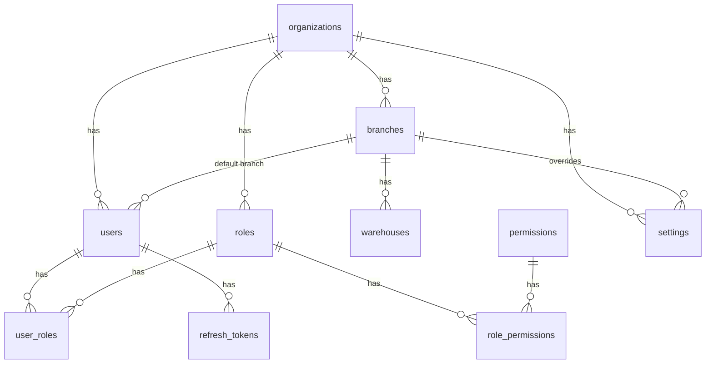
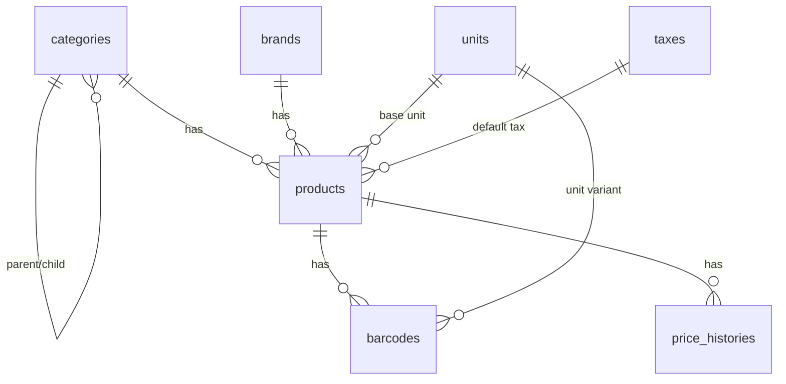
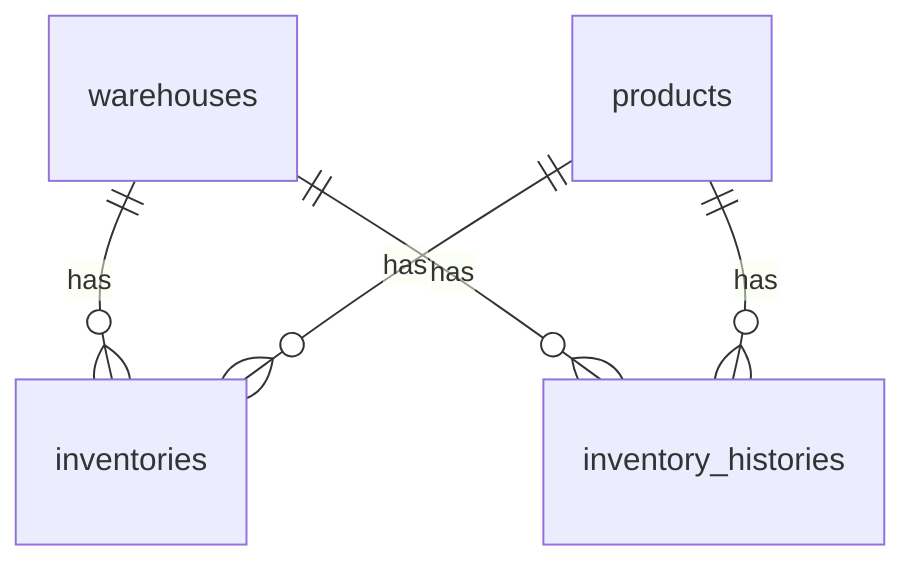
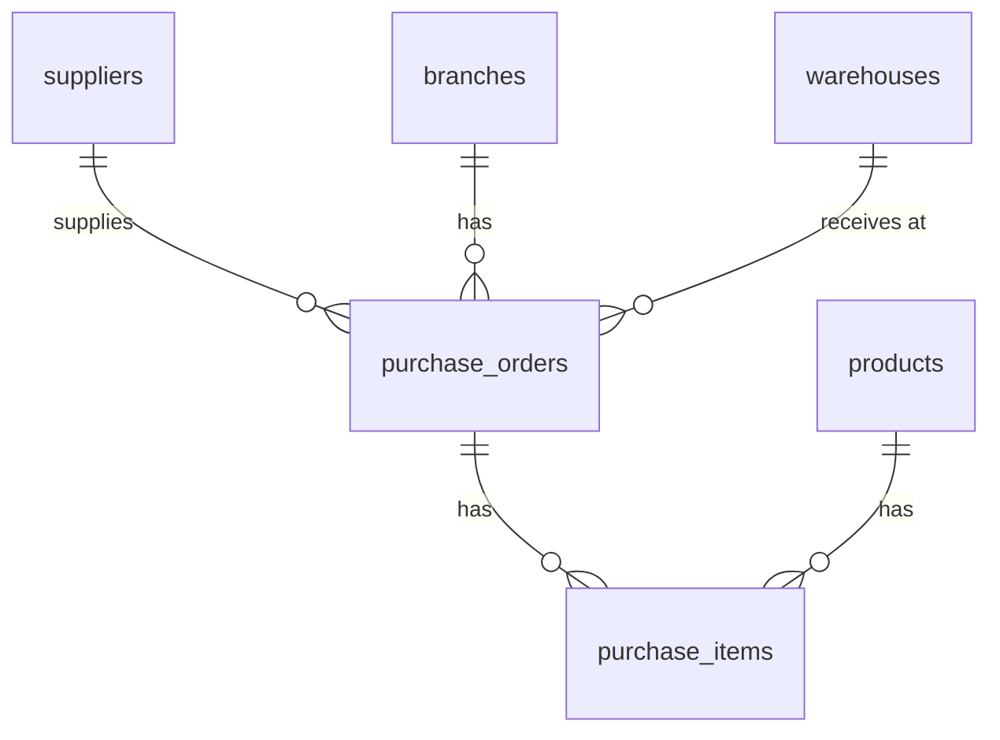
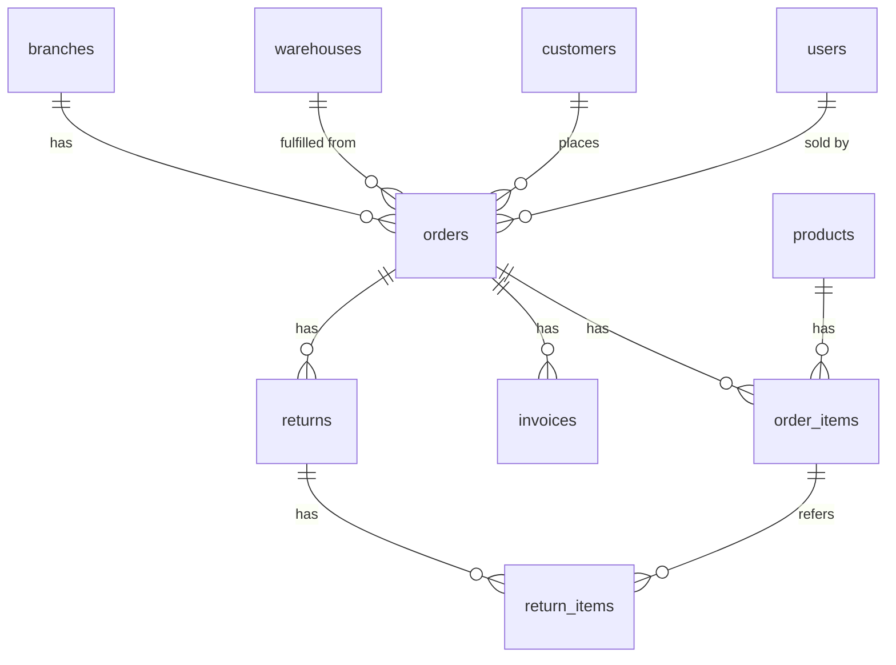
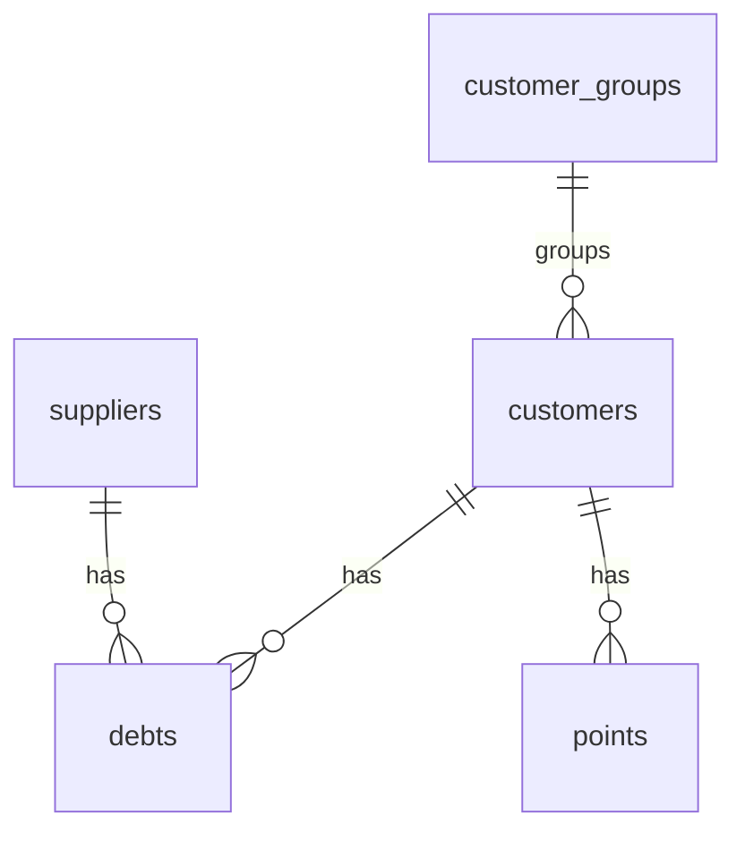
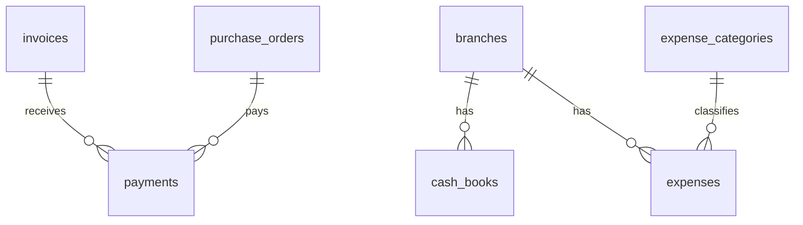
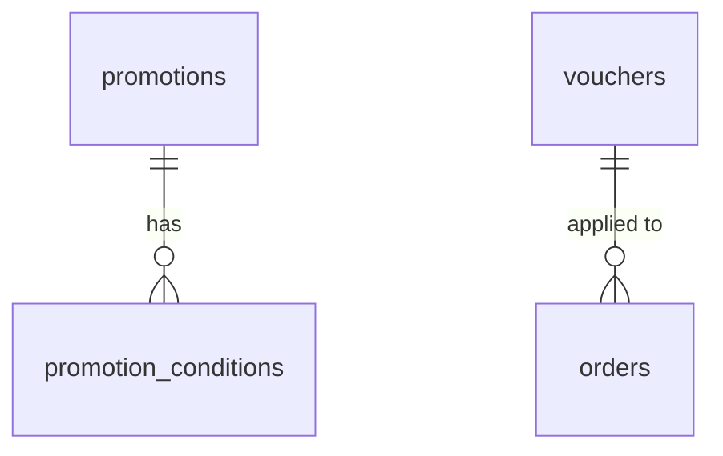
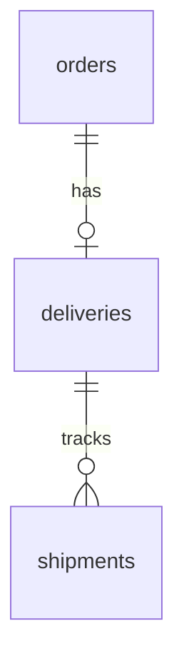
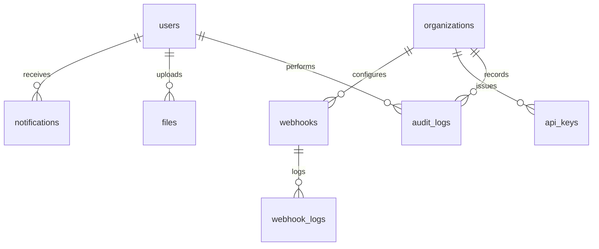

# POS ERP Enterprise v1.0 — Thiết kế Database (ERD)

**Prompt:** 002 — Thiết kế Database
**Input bắt buộc:** [001-architecture.md](./001-architecture.md)
**Không chứa code** (schema.prisma sẽ sinh ở Prompt 003 dựa trên tài liệu này).

---

## 0. Quy ước chung

### 0.1 ID Strategy
Mọi bảng dùng **UUID v4** làm khóa chính (`id UUID PK`), phù hợp môi trường multi-tenant/distributed, tránh lộ số lượng bản ghi qua ID tăng dần. Các bảng nghiệp vụ có thêm cột `code` (string, human-readable, unique theo `organizationId`) dùng để hiển thị/tìm kiếm (VD: `ORD-2026-000123`).

### 0.2 Base Audit Fields (áp dụng cho **100% bảng**, không lặp lại ở từng bảng bên dưới)

| Column | Type | Constraint |
|---|---|---|
| `id` | UUID | PK, default `gen_random_uuid()` |
| `createdBy` | UUID | FK → `users.id`, nullable (null = hệ thống) |
| `updatedBy` | UUID | FK → `users.id`, nullable |
| `createdAt` | TIMESTAMPTZ | NOT NULL, default `now()` |
| `updatedAt` | TIMESTAMPTZ | NOT NULL, auto-update |
| `deletedAt` | TIMESTAMPTZ | nullable — **Soft Delete**, mọi query mặc định filter `deletedAt IS NULL` |

### 0.3 Tenant Scope Convention
Mọi bảng nghiệp vụ có `organizationId UUID FK → organizations.id, NOT NULL, INDEX`. Ngoại lệ (bảng global, không thuộc riêng tenant nào): `organizations`, `permissions` (danh mục quyền hệ thống). Các bảng con phụ thuộc bảng cha đã có `organizationId` (VD: `order_items` phụ thuộc `orders`) có thể bỏ cột này để tránh trùng lặp, tenant được suy ra qua bảng cha — nhưng **Index/FK tới bảng cha là bắt buộc**.

### 0.4 Naming Convention
- Tên bảng: `snake_case`, số nhiều (`products`, `order_items`).
- Khóa ngoại: `<singular_ref>Id` (VD: `productId`, `warehouseId`).
- Enum: định nghĩa ở Prisma layer (Prompt 003), ở đây mô tả bằng danh sách giá trị.

### 0.5 Bảng bổ sung bắt buộc (ngoài danh sách gốc)
Để đảm bảo toàn vẹn quan hệ và đúng kiến trúc SaaS/RBAC đã chốt ở Prompt 001, bổ sung các bảng sau (không bảng nào trùng lặp chức năng với bảng đã liệt kê):

`organizations`, `role_permissions`, `user_roles`, `refresh_tokens`, `return_items`, `customer_groups`, `expense_categories`, `promotion_conditions`, `webhook_logs`, `api_keys`.

Lý do từng bảng được giải thích tại mục 2 tương ứng.

---

## 1. ERD theo Bounded Context

### 1.1 Identity & Access + Organization

### 1.2 Catalog

### 1.3 Inventory

### 1.4 Procurement

### 1.5 Sales

### 1.6 Customer Relationship

### 1.7 Finance

### 1.8 Marketing

### 1.9 Fulfillment

### 1.10 Platform

---

## 2. Đặc tả chi tiết từng bảng

> Mỗi bảng kế thừa **Base Audit Fields** (mục 0.2). Cột `organizationId` chỉ liệt kê khi cần nhấn mạnh Index/Unique đi kèm.

### 2.1 Identity & Access / Organization

#### `organizations` *(bổ sung — tenant root, điều kiện tiên quyết SaaS)*
| Column | Type | Constraint |
|---|---|---|
| name | varchar(255) | NOT NULL |
| slug | varchar(100) | UNIQUE, INDEX |
| plan | enum(`free`,`basic`,`pro`,`enterprise`) | default `free` |
| status | enum(`active`,`suspended`,`cancelled`) | default `active` |
| timezone | varchar(50) | default `Asia/Ho_Chi_Minh` |
| currency | varchar(3) | default `VND` |

#### `branches`
| Column | Type | Constraint |
|---|---|---|
| organizationId | UUID | FK → organizations.id, INDEX |
| code | varchar(50) | UNIQUE(organizationId, code) |
| name | varchar(255) | NOT NULL |
| address, phone | varchar | nullable |
| isMain | boolean | default false |
| status | enum(`active`,`inactive`) | default `active` |

#### `warehouses`
| Column | Type | Constraint |
|---|---|---|
| organizationId | UUID | FK, INDEX |
| branchId | UUID | FK → branches.id, INDEX |
| code | varchar(50) | UNIQUE(organizationId, code) |
| name | varchar(255) | NOT NULL |
| isDefault | boolean | default false |
| status | enum(`active`,`inactive`) | default `active` |

#### `settings`
| Column | Type | Constraint |
|---|---|---|
| organizationId | UUID | FK, INDEX |
| branchId | UUID | FK → branches.id, nullable (null = áp dụng toàn org) |
| key | varchar(150) | NOT NULL |
| value | jsonb | NOT NULL |
| category | varchar(50) | INDEX |
| — | — | **UNIQUE(organizationId, branchId, key)** |

#### `users`
| Column | Type | Constraint |
|---|---|---|
| organizationId | UUID | FK, INDEX |
| branchId | UUID | FK → branches.id, nullable |
| username | varchar(100) | UNIQUE(organizationId, username) |
| email | varchar(255) | UNIQUE(organizationId, email), INDEX |
| phone | varchar(20) | nullable |
| passwordHash | varchar(255) | NOT NULL |
| avatar | varchar(500) | nullable |
| status | enum(`active`,`inactive`,`locked`) | default `active` |
| lastLoginAt | timestamptz | nullable |

#### `roles`
| Column | Type | Constraint |
|---|---|---|
| organizationId | UUID | FK, INDEX |
| code | varchar(50) | UNIQUE(organizationId, code) |
| name | varchar(100) | NOT NULL |
| isSystem | boolean | default false (role dựng sẵn không cho xóa: Owner/Admin) |
| description | text | nullable |

#### `permissions` *(global — không có organizationId)*
| Column | Type | Constraint |
|---|---|---|
| code | varchar(100) | UNIQUE (VD: `product.create`, `order.void`) |
| group | varchar(50) | INDEX (VD: `product`, `order`, `report`) |
| description | text | nullable |

#### `role_permissions` *(bổ sung — join table N-N)*
| Column | Type | Constraint |
|---|---|---|
| roleId | UUID | FK → roles.id, INDEX |
| permissionId | UUID | FK → permissions.id, INDEX |
| — | — | **UNIQUE(roleId, permissionId)** |

#### `user_roles` *(bổ sung — join table N-N, hỗ trợ multi-role/user)*
| Column | Type | Constraint |
|---|---|---|
| userId | UUID | FK → users.id, INDEX |
| roleId | UUID | FK → roles.id, INDEX |
| — | — | **UNIQUE(userId, roleId)** |

#### `refresh_tokens` *(bổ sung — bắt buộc cho JWT rotation theo Prompt 001 §8)*
| Column | Type | Constraint |
|---|---|---|
| userId | UUID | FK → users.id, INDEX |
| tokenHash | varchar(255) | UNIQUE |
| userAgent, ip | varchar | nullable |
| expiresAt | timestamptz | NOT NULL, INDEX |
| revokedAt | timestamptz | nullable |

#### `audit_logs`
| Column | Type | Constraint |
|---|---|---|
| organizationId | UUID | FK, INDEX |
| userId | UUID | FK → users.id, nullable, INDEX |
| action | varchar(100) | NOT NULL (VD: `order.create`, `user.login`) |
| entityType | varchar(100) | INDEX |
| entityId | UUID | INDEX |
| oldValue, newValue | jsonb | nullable |
| ip, userAgent | varchar | nullable |

---

### 2.2 Catalog

#### `categories`
| Column | Type | Constraint |
|---|---|---|
| organizationId | UUID | FK, INDEX |
| parentId | UUID | FK → categories.id (self-relation), nullable, INDEX |
| code | varchar(50) | UNIQUE(organizationId, code) |
| name, slug | varchar | NOT NULL |
| sortOrder | int | default 0 |
| status | enum(`active`,`inactive`) | default `active` |

#### `brands`
| Column | Type | Constraint |
|---|---|---|
| organizationId | UUID | FK, INDEX |
| code | varchar(50) | UNIQUE(organizationId, code) |
| name | varchar(150) | NOT NULL |
| logo | varchar(500) | nullable |
| status | enum(`active`,`inactive`) | default `active` |

#### `units`
| Column | Type | Constraint |
|---|---|---|
| organizationId | UUID | FK, INDEX |
| code | varchar(20) | UNIQUE(organizationId, code) |
| name, symbol | varchar | NOT NULL |

#### `taxes`
| Column | Type | Constraint |
|---|---|---|
| organizationId | UUID | FK, INDEX |
| code | varchar(20) | UNIQUE(organizationId, code) |
| name | varchar(100) | NOT NULL |
| rate | decimal(5,2) | NOT NULL (VD: 8.00, 10.00) |
| isDefault | boolean | default false |
| status | enum(`active`,`inactive`) | default `active` |

#### `products`
| Column | Type | Constraint |
|---|---|---|
| organizationId | UUID | FK, INDEX |
| categoryId | UUID | FK → categories.id, INDEX |
| brandId | UUID | FK → brands.id, nullable, INDEX |
| baseUnitId | UUID | FK → units.id |
| taxId | UUID | FK → taxes.id, nullable |
| sku | varchar(100) | UNIQUE(organizationId, sku), INDEX |
| name | varchar(255) | NOT NULL, INDEX (full-text search sau) |
| costPrice, sellingPrice | decimal(18,2) | NOT NULL |
| minStock, maxStock | int | nullable |
| isService | boolean | default false (dịch vụ không quản lý tồn) |
| allowSale | boolean | default true |
| status | enum(`active`,`inactive`,`discontinued`) | default `active` |

#### `barcodes`
| Column | Type | Constraint |
|---|---|---|
| productId | UUID | FK → products.id, INDEX |
| unitId | UUID | FK → units.id, nullable (mã vạch riêng theo quy cách đóng gói) |
| code | varchar(100) | UNIQUE, INDEX |
| isDefault | boolean | default false |

#### `price_histories`
| Column | Type | Constraint |
|---|---|---|
| productId | UUID | FK → products.id, INDEX |
| priceType | enum(`cost`,`selling`) | NOT NULL |
| oldPrice, newPrice | decimal(18,2) | NOT NULL |
| changedBy | UUID | FK → users.id |
| reason | varchar(255) | nullable |

---

### 2.3 Inventory

#### `inventories`
| Column | Type | Constraint |
|---|---|---|
| organizationId | UUID | FK, INDEX |
| warehouseId | UUID | FK → warehouses.id, INDEX |
| productId | UUID | FK → products.id, INDEX |
| quantity | decimal(18,3) | default 0 |
| reservedQty | decimal(18,3) | default 0 (giữ hàng cho đơn chưa hoàn tất) |
| avgCost | decimal(18,2) | default 0 (giá vốn bình quân) |
| — | — | **UNIQUE(warehouseId, productId)** |

#### `inventory_histories`
| Column | Type | Constraint |
|---|---|---|
| organizationId | UUID | FK, INDEX |
| warehouseId | UUID | FK → warehouses.id, INDEX |
| productId | UUID | FK → products.id, INDEX |
| type | enum(`purchase_in`,`sale_out`,`transfer_in`,`transfer_out`,`adjustment`,`return_in`) | NOT NULL, INDEX |
| quantityChange | decimal(18,3) | NOT NULL (âm/dương) |
| quantityAfter | decimal(18,3) | NOT NULL |
| refType, refId | varchar / UUID | INDEX (polymorphic ref tới Order/PurchaseOrder/Return...) |
| note | varchar(255) | nullable |

---

### 2.4 Procurement

#### `suppliers`
| Column | Type | Constraint |
|---|---|---|
| organizationId | UUID | FK, INDEX |
| code | varchar(50) | UNIQUE(organizationId, code) |
| name | varchar(255) | NOT NULL |
| phone, email, address, taxCode | varchar | nullable |
| debtAmount | decimal(18,2) | default 0 |
| status | enum(`active`,`inactive`) | default `active` |

#### `purchase_orders`
| Column | Type | Constraint |
|---|---|---|
| organizationId | UUID | FK, INDEX |
| branchId | UUID | FK → branches.id |
| warehouseId | UUID | FK → warehouses.id |
| supplierId | UUID | FK → suppliers.id, INDEX |
| code | varchar(50) | UNIQUE(organizationId, code) |
| status | enum(`draft`,`ordered`,`partially_received`,`received`,`cancelled`) | INDEX |
| totalAmount, paidAmount | decimal(18,2) | default 0 |
| expectedAt | timestamptz | nullable |

#### `purchase_items`
| Column | Type | Constraint |
|---|---|---|
| purchaseOrderId | UUID | FK → purchase_orders.id, INDEX |
| productId | UUID | FK → products.id, INDEX |
| quantity, receivedQuantity | decimal(18,3) | NOT NULL |
| unitCost | decimal(18,2) | NOT NULL |
| discount, totalAmount | decimal(18,2) | default 0 |

---

### 2.5 Sales

#### `orders`
| Column | Type | Constraint |
|---|---|---|
| organizationId | UUID | FK, INDEX |
| branchId | UUID | FK → branches.id, INDEX |
| warehouseId | UUID | FK → warehouses.id |
| customerId | UUID | FK → customers.id, nullable, INDEX |
| soldBy | UUID | FK → users.id |
| code | varchar(50) | UNIQUE(organizationId, code) |
| type | enum(`pos`,`online`) | default `pos` |
| status | enum(`pending`,`confirmed`,`completed`,`cancelled`,`returned`) | INDEX |
| subTotal, discountAmount, taxAmount, shippingFee, totalAmount | decimal(18,2) | NOT NULL |
| note | text | nullable |

#### `order_items`
| Column | Type | Constraint |
|---|---|---|
| orderId | UUID | FK → orders.id, INDEX |
| productId | UUID | FK → products.id, INDEX |
| quantity | decimal(18,3) | NOT NULL |
| unitPrice, discount, taxAmount, totalAmount | decimal(18,2) | NOT NULL |

#### `invoices`
| Column | Type | Constraint |
|---|---|---|
| organizationId | UUID | FK, INDEX |
| branchId | UUID | FK → branches.id |
| orderId | UUID | FK → orders.id, INDEX |
| code | varchar(50) | UNIQUE(organizationId, code) |
| status | enum(`unpaid`,`partial`,`paid`,`cancelled`) | INDEX |
| totalAmount, paidAmount, dueAmount | decimal(18,2) | NOT NULL |
| dueDate | timestamptz | nullable |

#### `returns`
| Column | Type | Constraint |
|---|---|---|
| organizationId | UUID | FK, INDEX |
| orderId | UUID | FK → orders.id, INDEX |
| code | varchar(50) | UNIQUE(organizationId, code) |
| reason | varchar(255) | nullable |
| status | enum(`pending`,`approved`,`rejected`,`refunded`) | INDEX |
| totalRefund | decimal(18,2) | NOT NULL |
| processedBy | UUID | FK → users.id, nullable |

#### `return_items` *(bổ sung — bắt buộc để Return có dòng chi tiết, tương tự OrderItems)*
| Column | Type | Constraint |
|---|---|---|
| returnId | UUID | FK → returns.id, INDEX |
| orderItemId | UUID | FK → order_items.id |
| productId | UUID | FK → products.id, INDEX |
| quantity | decimal(18,3) | NOT NULL |
| refundAmount | decimal(18,2) | NOT NULL |

---

### 2.6 Customer Relationship

#### `customer_groups` *(bổ sung — cần cho chính sách giá/chiết khấu theo nhóm KH, tham chiếu chuẩn KiotViet)*
| Column | Type | Constraint |
|---|---|---|
| organizationId | UUID | FK, INDEX |
| name | varchar(100) | NOT NULL |
| discountRate | decimal(5,2) | default 0 |

#### `customers`
| Column | Type | Constraint |
|---|---|---|
| organizationId | UUID | FK, INDEX |
| groupId | UUID | FK → customer_groups.id, nullable |
| code | varchar(50) | UNIQUE(organizationId, code) |
| name | varchar(255) | NOT NULL, INDEX |
| phone | varchar(20) | UNIQUE(organizationId, phone) |
| email, address | varchar | nullable |
| debtAmount | decimal(18,2) | default 0 |
| pointBalance | int | default 0 |
| birthday | date | nullable |
| gender | enum(`male`,`female`,`other`) | nullable |
| status | enum(`active`,`inactive`) | default `active` |

#### `debts`
| Column | Type | Constraint |
|---|---|---|
| organizationId | UUID | FK, INDEX |
| customerId | UUID | FK → customers.id, nullable, INDEX |
| supplierId | UUID | FK → suppliers.id, nullable, INDEX |
| type | enum(`receivable`,`payable`) | NOT NULL, INDEX |
| refType, refId | varchar / UUID | INDEX (Order/Invoice/PurchaseOrder) |
| amount, paidAmount | decimal(18,2) | NOT NULL |
| dueDate | timestamptz | nullable |
| status | enum(`open`,`partial`,`settled`,`overdue`) | INDEX |

> Ràng buộc nghiệp vụ: `customerId` XOR `supplierId` phải có đúng 1 giá trị (CHECK constraint), không được cả hai cùng null hoặc cùng có giá trị.

#### `points`
| Column | Type | Constraint |
|---|---|---|
| organizationId | UUID | FK, INDEX |
| customerId | UUID | FK → customers.id, INDEX |
| type | enum(`earn`,`redeem`,`expire`,`adjust`) | NOT NULL |
| points | int | NOT NULL (âm/dương) |
| refType, refId | varchar / UUID | nullable |
| expiresAt | timestamptz | nullable |

---

### 2.7 Finance

#### `payments`
| Column | Type | Constraint |
|---|---|---|
| organizationId | UUID | FK, INDEX |
| branchId | UUID | FK → branches.id |
| invoiceId | UUID | FK → invoices.id, nullable, INDEX |
| purchaseOrderId | UUID | FK → purchase_orders.id, nullable, INDEX |
| customerId | UUID | FK → customers.id, nullable |
| supplierId | UUID | FK → suppliers.id, nullable |
| method | enum(`cash`,`bank_transfer`,`card`,`e_wallet`) | NOT NULL |
| direction | enum(`in`,`out`) | NOT NULL, INDEX |
| amount | decimal(18,2) | NOT NULL |
| paidAt | timestamptz | NOT NULL |
| receivedBy | UUID | FK → users.id |

#### `cash_books`
| Column | Type | Constraint |
|---|---|---|
| organizationId | UUID | FK, INDEX |
| branchId | UUID | FK → branches.id, INDEX |
| code | varchar(50) | UNIQUE(organizationId, code) |
| type | enum(`receipt`,`payment`) | NOT NULL, INDEX |
| category | varchar(100) | INDEX |
| amount | decimal(18,2) | NOT NULL |
| balanceAfter | decimal(18,2) | NOT NULL |
| refType, refId | varchar / UUID | nullable |
| note | varchar(255) | nullable |

#### `expense_categories` *(bổ sung — chuẩn hóa danh mục chi phí thay vì free-text)*
| Column | Type | Constraint |
|---|---|---|
| organizationId | UUID | FK, INDEX |
| name | varchar(100) | NOT NULL |

#### `expenses`
| Column | Type | Constraint |
|---|---|---|
| organizationId | UUID | FK, INDEX |
| branchId | UUID | FK → branches.id |
| categoryId | UUID | FK → expense_categories.id, nullable |
| code | varchar(50) | UNIQUE(organizationId, code) |
| amount | decimal(18,2) | NOT NULL |
| description | varchar(255) | nullable |
| paidAt | timestamptz | NOT NULL |

---

### 2.8 Marketing

#### `promotions`
| Column | Type | Constraint |
|---|---|---|
| organizationId | UUID | FK, INDEX |
| branchId | UUID | FK → branches.id, nullable (null = áp dụng toàn tổ chức) |
| code | varchar(50) | UNIQUE(organizationId, code) |
| name | varchar(255) | NOT NULL |
| type | enum(`percentage`,`fixed_amount`,`gift`) | NOT NULL |
| value | decimal(18,2) | NOT NULL |
| applyScope | enum(`all`,`category`,`product`) | NOT NULL |
| startDate, endDate | timestamptz | NOT NULL, INDEX |
| status | enum(`active`,`inactive`,`expired`) | INDEX |

#### `promotion_conditions` *(bổ sung — tách điều kiện áp dụng khỏi bảng chính để hỗ trợ nhiều điều kiện/khuyến mãi)*
| Column | Type | Constraint |
|---|---|---|
| promotionId | UUID | FK → promotions.id, INDEX |
| conditionType | enum(`category`,`product`,`min_amount`,`min_quantity`) | NOT NULL |
| targetId | UUID | nullable (categoryId/productId tùy conditionType) |
| minQuantity | int | nullable |
| minAmount | decimal(18,2) | nullable |

#### `vouchers`
| Column | Type | Constraint |
|---|---|---|
| organizationId | UUID | FK, INDEX |
| code | varchar(50) | UNIQUE(organizationId, code), INDEX |
| type | enum(`percentage`,`fixed_amount`) | NOT NULL |
| value, minOrderAmount, maxDiscount | decimal(18,2) | nullable |
| usageLimit, usedCount | int | default 0 |
| startDate, endDate | timestamptz | NOT NULL |
| status | enum(`active`,`inactive`,`expired`) | INDEX |

---

### 2.9 Fulfillment

#### `deliveries`
| Column | Type | Constraint |
|---|---|---|
| organizationId | UUID | FK, INDEX |
| orderId | UUID | FK → orders.id, UNIQUE (1-1 với Order) |
| code | varchar(50) | UNIQUE(organizationId, code) |
| status | enum(`pending`,`picked_up`,`in_transit`,`delivered`,`failed`,`returned`) | INDEX |
| recipientName, recipientPhone, address | varchar | NOT NULL |
| fee | decimal(18,2) | default 0 |

#### `shipments`
| Column | Type | Constraint |
|---|---|---|
| deliveryId | UUID | FK → deliveries.id, INDEX |
| carrier | varchar(100) | nullable (GHTK/GHN/Viettel Post/tự vận chuyển) |
| trackingNumber | varchar(100) | nullable, INDEX |
| status | enum(`created`,`shipping`,`delivered`,`failed`) | INDEX |
| shippedAt, deliveredAt | timestamptz | nullable |

---

### 2.10 Platform (Shared Kernel)

#### `notifications`
| Column | Type | Constraint |
|---|---|---|
| organizationId | UUID | FK, INDEX |
| userId | UUID | FK → users.id, nullable (null = broadcast toàn org), INDEX |
| title | varchar(255) | NOT NULL |
| content | text | NOT NULL |
| type | varchar(50) | INDEX (VD: `order`, `inventory`, `system`) |
| channel | enum(`in_app`,`email`,`sms`) | default `in_app` |
| isRead | boolean | default false |
| readAt | timestamptz | nullable |

#### `files`
| Column | Type | Constraint |
|---|---|---|
| organizationId | UUID | FK, INDEX |
| ownerType, ownerId | varchar / UUID | INDEX (polymorphic — Product/User/Order...) |
| fileName, filePath | varchar(500) | NOT NULL |
| mimeType | varchar(100) | NOT NULL |
| size | int | NOT NULL (bytes) |
| uploadedBy | UUID | FK → users.id |

#### `webhooks`
| Column | Type | Constraint |
|---|---|---|
| organizationId | UUID | FK, INDEX |
| url | varchar(500) | NOT NULL |
| event | varchar(100) | INDEX (VD: `order.completed`) |
| secret | varchar(255) | NOT NULL (HMAC signing) |
| isActive | boolean | default true |
| lastTriggeredAt | timestamptz | nullable |

#### `webhook_logs` *(bổ sung — bắt buộc để audit/replay webhook, tránh mất log khi FE cần debug tích hợp)*
| Column | Type | Constraint |
|---|---|---|
| webhookId | UUID | FK → webhooks.id, INDEX |
| event | varchar(100) | NOT NULL |
| payload | jsonb | NOT NULL |
| responseStatus | int | nullable |
| success | boolean | default false |

#### `api_keys` *(bổ sung — cần thiết cho module "API" theo Prompt 001, cấp key cho tích hợp bên ngoài)*
| Column | Type | Constraint |
|---|---|---|
| organizationId | UUID | FK, INDEX |
| name | varchar(100) | NOT NULL |
| keyHash | varchar(255) | UNIQUE |
| scopes | varchar[] | NOT NULL (danh sách permission code được phép) |
| lastUsedAt, expiresAt | timestamptz | nullable |

---

## 3. Chỉ mục quan trọng (Index Summary — ngoài Index đã liệt kê theo bảng)

| Bảng | Composite Index | Mục đích |
|---|---|---|
| `orders` | (organizationId, branchId, createdAt) | Truy vấn báo cáo doanh thu theo chi nhánh/ngày (Dashboard) |
| `inventories` | (organizationId, warehouseId, productId) | Tra cứu tồn kho realtime tại POS |
| `inventory_histories` | (productId, createdAt) | Lịch sử biến động tồn theo sản phẩm |
| `debts` | (organizationId, status, dueDate) | Danh sách công nợ quá hạn (hiển thị ở Dashboard "nợ quá 10 ngày") |
| `notifications` | (userId, isRead) | Đếm thông báo chưa đọc |
| `audit_logs` | (organizationId, entityType, entityId) | Tra cứu lịch sử thay đổi 1 bản ghi cụ thể |

Tất cả các cột `organizationId` trên mọi bảng đều có **INDEX** riêng lẻ (bắt buộc, do mọi query đều filter theo tenant trước tiên qua `TenantContextService`).

---

## 4. Ma trận đối chiếu bảng yêu cầu (Acceptance Check)

| Bảng yêu cầu | Trạng thái | Ghi chú |
|---|---|---|
| Users | ✔ | `users` |
| Roles | ✔ | `roles` |
| Permissions | ✔ | `permissions` |
| Branches | ✔ | `branches` |
| Warehouses | ✔ | `warehouses` |
| Products | ✔ | `products` |
| Categories | ✔ | `categories` |
| Brands | ✔ | `brands` |
| Units | ✔ | `units` |
| Suppliers | ✔ | `suppliers` |
| Customers | ✔ | `customers` |
| Orders | ✔ | `orders` |
| OrderItems | ✔ | `order_items` |
| Invoices | ✔ | `invoices` |
| Payments | ✔ | `payments` |
| Inventory | ✔ | `inventories` |
| InventoryHistory | ✔ | `inventory_histories` |
| PurchaseOrders | ✔ | `purchase_orders` |
| PurchaseItems | ✔ | `purchase_items` |
| Returns | ✔ | `returns` (+ `return_items` bổ sung) |
| Debt | ✔ | `debts` |
| Expense | ✔ | `expenses` (+ `expense_categories` bổ sung) |
| CashBook | ✔ | `cash_books` |
| Voucher | ✔ | `vouchers` |
| Promotion | ✔ | `promotions` (+ `promotion_conditions` bổ sung) |
| Point | ✔ | `points` |
| Notification | ✔ | `notifications` |
| AuditLog | ✔ | `audit_logs` |
| File | ✔ | `files` |
| Setting | ✔ | `settings` |
| Barcode | ✔ | `barcodes` |
| PriceHistory | ✔ | `price_histories` |
| Delivery | ✔ | `deliveries` |
| Shipment | ✔ | `shipments` |
| Tax | ✔ | `taxes` |

**35/35 bảng gốc — đầy đủ, không thiếu. Tổng cộng 46 bảng** (35 gốc + `organizations`, `role_permissions`, `user_roles`, `refresh_tokens`, `return_items`, `customer_groups`, `expense_categories`, `promotion_conditions`, `webhook_logs`, `api_keys` — 10 bảng bổ sung bắt buộc để đảm bảo toàn vẹn quan hệ, không có bảng trùng chức năng).

---

*Tài liệu này là input bắt buộc cho Prompt 003 (Sinh Prisma Schema).*
