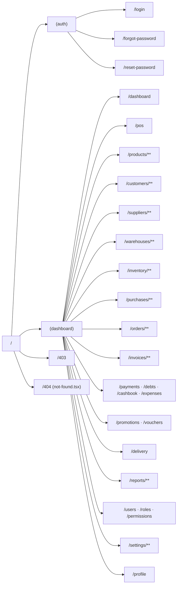

# POS ERP Enterprise v1.0 — Routing / Sitemap / Route Tree

**Prompt:** 008 — Thiết kế Routing
**Input bắt buộc:** [001-architecture.md](./001-architecture.md) (folder structure §5.2)
**Không chứa code.** Route Group và file quy ước dưới đây map trực tiếp sang Next.js 15 App Router khi triển khai code ở các Prompt module (023+).

---

## 0. Quy ước Route Group

| Group | Mục đích | Bảo vệ |
|---|---|---|
| `(auth)` | Đăng nhập, quên mật khẩu — layout tối giản, không sidebar | Public (redirect nếu đã đăng nhập) |
| `(dashboard)` | Toàn bộ nghiệp vụ sau đăng nhập — layout có Sidebar + Topbar | Yêu cầu JWT hợp lệ + kiểm tra Permission per-route |
| root (`/403`, `/404`) | Trang lỗi | Public |

Middleware (`middleware.ts`, cấu hình chi tiết ở Prompt Authentication) chặn truy cập `(dashboard)/**` nếu chưa đăng nhập → redirect `/login`; chặn nếu thiếu permission → redirect `/403`.

---

## 1. Sitemap (danh sách route đầy đủ)

| # | Path | Bounded Context | Mô tả | Permission gợi ý |
|---|---|---|---|---|
| 1 | `/login` | IAM | Đăng nhập | public |
| 2 | `/forgot-password` | IAM | Quên mật khẩu — gửi email/OTP | public |
| 3 | `/reset-password` | IAM | Đặt lại mật khẩu từ token | public |
| 4 | `/dashboard` | Reporting | Tổng quan (giống ảnh KiotViet đã tham khảo) | `dashboard.view` |
| 5 | `/pos` | Sales | Màn hình bán hàng tại quầy (POS) | `pos.access` |
| 6 | `/products` | Catalog | Danh sách sản phẩm | `product.view` |
| 7 | `/products/new` | Catalog | Thêm sản phẩm | `product.create` |
| 8 | `/products/[id]` | Catalog | Chi tiết/sửa sản phẩm | `product.view` |
| 9 | `/products/categories` | Catalog | Danh mục ngành hàng | `category.view` |
| 10 | `/products/brands` | Catalog | Thương hiệu | `brand.view` |
| 11 | `/products/units` | Catalog | Đơn vị tính | `unit.view` |
| 12 | `/customers` | CRM | Danh sách khách hàng | `customer.view` |
| 13 | `/customers/new` | CRM | Thêm khách hàng | `customer.create` |
| 14 | `/customers/[id]` | CRM | Chi tiết khách hàng (đơn hàng, công nợ, điểm) | `customer.view` |
| 15 | `/customers/groups` | CRM | Nhóm khách hàng | `customer_group.view` |
| 16 | `/suppliers` | Procurement | Danh sách nhà cung cấp | `supplier.view` |
| 17 | `/suppliers/new` | Procurement | Thêm nhà cung cấp | `supplier.create` |
| 18 | `/suppliers/[id]` | Procurement | Chi tiết nhà cung cấp | `supplier.view` |
| 19 | `/warehouses` | Inventory | Danh sách kho | `warehouse.view` |
| 20 | `/warehouses/new` | Inventory | Thêm kho | `warehouse.create` |
| 21 | `/warehouses/[id]` | Inventory | Chi tiết kho | `warehouse.view` |
| 22 | `/inventory` | Inventory | Tồn kho theo sản phẩm/kho | `inventory.view` |
| 23 | `/inventory/transfer` | Inventory | Chuyển kho | `inventory.transfer` |
| 24 | `/inventory/adjustment` | Inventory | Kiểm kê / điều chỉnh tồn | `inventory.adjust` |
| 25 | `/inventory/history` | Inventory | Lịch sử biến động tồn | `inventory.view` |
| 26 | `/purchases` | Procurement | Danh sách đơn nhập hàng | `purchase.view` |
| 27 | `/purchases/new` | Procurement | Tạo đơn nhập hàng | `purchase.create` |
| 28 | `/purchases/[id]` | Procurement | Chi tiết đơn nhập | `purchase.view` |
| 29 | `/orders` | Sales | Danh sách đơn hàng | `order.view` |
| 30 | `/orders/[id]` | Sales | Chi tiết đơn hàng | `order.view` |
| 31 | `/orders/returns` | Sales | Danh sách trả hàng | `return.view` |
| 32 | `/orders/returns/[id]` | Sales | Chi tiết trả hàng | `return.view` |
| 33 | `/invoices` | Sales | Danh sách hóa đơn | `invoice.view` |
| 34 | `/invoices/[id]` | Sales | Chi tiết hóa đơn | `invoice.view` |
| 35 | `/payments` | Finance | Danh sách thu/chi theo giao dịch | `payment.view` |
| 36 | `/debts` | CRM/Finance | Công nợ phải thu/phải trả | `debt.view` |
| 37 | `/cashbook` | Finance | Sổ quỹ | `cashbook.view` |
| 38 | `/expenses` | Finance | Chi phí | `expense.view` |
| 39 | `/promotions` | Marketing | Khuyến mãi | `promotion.view` |
| 40 | `/vouchers` | Marketing | Mã giảm giá | `voucher.view` |
| 41 | `/delivery` | Fulfillment | Vận đơn / giao hàng | `delivery.view` |
| 42 | `/reports` | Reporting | Trang tổng hợp báo cáo | `report.view` |
| 43 | `/reports/revenue` | Reporting | Báo cáo doanh thu | `report.view` |
| 44 | `/reports/inventory` | Reporting | Báo cáo tồn kho | `report.view` |
| 45 | `/reports/customers` | Reporting | Báo cáo khách hàng | `report.view` |
| 46 | `/reports/staff` | Reporting | Báo cáo hiệu suất nhân viên | `report.view` |
| 47 | `/users` | IAM | Danh sách nhân viên | `user.view` |
| 48 | `/users/new` | IAM | Thêm nhân viên | `user.create` |
| 49 | `/users/[id]` | IAM | Chi tiết/sửa nhân viên | `user.view` |
| 50 | `/roles` | IAM | Danh sách vai trò | `role.view` |
| 51 | `/roles/new` | IAM | Thêm vai trò | `role.create` |
| 52 | `/roles/[id]` | IAM | Chi tiết/sửa vai trò + gán quyền | `role.view` |
| 53 | `/permissions` | IAM | Danh mục quyền hệ thống (chỉ xem, seed sẵn) | `permission.view` |
| 54 | `/settings` | Organization | Cài đặt chung (tổ chức, chi nhánh, thuế…) | `setting.view` |
| 55 | `/settings/branches` | Organization | Quản lý chi nhánh | `branch.view` |
| 56 | `/settings/taxes` | Catalog | Thuế suất | `tax.view` |
| 57 | `/settings/notifications` | Platform | Cấu hình kênh thông báo | `setting.view` |
| 58 | `/settings/webhooks` | Platform | Webhook / API Key | `webhook.view` |
| 59 | `/profile` | IAM | Hồ sơ cá nhân người dùng đang đăng nhập | authenticated (mọi role) |
| 60 | `/403` | Platform | Không đủ quyền truy cập | public |
| 61 | `/404` | Platform | Không tìm thấy trang | public |

---

## 2. Route Tree (Next.js App Router — `frontend/src/app`)

```
app/
├── (auth)/
│   ├── layout.tsx                      # Layout tối giản, căn giữa form
│   ├── login/page.tsx
│   ├── forgot-password/page.tsx
│   └── reset-password/page.tsx
│
├── (dashboard)/
│   ├── layout.tsx                      # Sidebar + Topbar + AuthGuard + PermissionGuard
│   │
│   ├── dashboard/page.tsx
│   │
│   ├── pos/page.tsx                    # Full-screen, có thể override layout con
│   │
│   ├── products/
│   │   ├── page.tsx
│   │   ├── new/page.tsx
│   │   ├── [id]/page.tsx
│   │   ├── categories/page.tsx
│   │   ├── brands/page.tsx
│   │   └── units/page.tsx
│   │
│   ├── customers/
│   │   ├── page.tsx
│   │   ├── new/page.tsx
│   │   ├── [id]/page.tsx
│   │   └── groups/page.tsx
│   │
│   ├── suppliers/
│   │   ├── page.tsx
│   │   ├── new/page.tsx
│   │   └── [id]/page.tsx
│   │
│   ├── warehouses/
│   │   ├── page.tsx
│   │   ├── new/page.tsx
│   │   └── [id]/page.tsx
│   │
│   ├── inventory/
│   │   ├── page.tsx
│   │   ├── transfer/page.tsx
│   │   ├── adjustment/page.tsx
│   │   └── history/page.tsx
│   │
│   ├── purchases/
│   │   ├── page.tsx
│   │   ├── new/page.tsx
│   │   └── [id]/page.tsx
│   │
│   ├── orders/
│   │   ├── page.tsx
│   │   ├── [id]/page.tsx
│   │   └── returns/
│   │       ├── page.tsx
│   │       └── [id]/page.tsx
│   │
│   ├── invoices/
│   │   ├── page.tsx
│   │   └── [id]/page.tsx
│   │
│   ├── payments/page.tsx
│   ├── debts/page.tsx
│   ├── cashbook/page.tsx
│   ├── expenses/page.tsx
│   │
│   ├── promotions/page.tsx
│   ├── vouchers/page.tsx
│   ├── delivery/page.tsx
│   │
│   ├── reports/
│   │   ├── page.tsx
│   │   ├── revenue/page.tsx
│   │   ├── inventory/page.tsx
│   │   ├── customers/page.tsx
│   │   └── staff/page.tsx
│   │
│   ├── users/
│   │   ├── page.tsx
│   │   ├── new/page.tsx
│   │   └── [id]/page.tsx
│   │
│   ├── roles/
│   │   ├── page.tsx
│   │   ├── new/page.tsx
│   │   └── [id]/page.tsx
│   │
│   ├── permissions/page.tsx
│   │
│   ├── settings/
│   │   ├── page.tsx
│   │   ├── branches/page.tsx
│   │   ├── taxes/page.tsx
│   │   ├── notifications/page.tsx
│   │   └── webhooks/page.tsx
│   │
│   └── profile/page.tsx
│
├── 403/page.tsx
├── not-found.tsx                       # Next.js quy ước cho 404 toàn cục
├── layout.tsx                          # Root layout (Providers, fonts, theme) — đã có ở Prompt 007
└── page.tsx                            # Redirect "/" → "/dashboard" (nếu đã đăng nhập) hoặc "/login"
```



---

## 3. Quy tắc bảo vệ route (áp dụng ở `middleware.ts`, hiện thực ở Prompt Authentication)

1. Mọi route trong `(dashboard)` yêu cầu access token hợp lệ (cookie httpOnly) — thiếu/hết hạn → redirect `/login?redirect=<path>`.
2. Sau khi xác thực, route được đối chiếu với bảng **Permission gợi ý** ở mục 1 — thiếu quyền → redirect `/403`.
3. `/pos` có thể yêu cầu thêm điều kiện nghiệp vụ: user phải thuộc một `branchId` cụ thể (không cho thao tác trên chi nhánh khác) — kiểm tra ở tầng Application, không phải routing, nhưng route layout hiển thị branch selector nếu user có quyền truy cập nhiều chi nhánh.
4. `/permissions` chỉ hiển thị (read-only) — danh mục quyền hệ thống được seed sẵn, không cho tạo/sửa qua UI ở giai đoạn 1.
5. Route không khớp bất kỳ pattern nào ở trên → Next.js tự render `not-found.tsx` (404).

---

*Tài liệu này là input cho Prompt 009 (Design System) và Prompt 010 (UI Dashboard Wireframe), đồng thời là cấu trúc thư mục bắt buộc khi hiện thực từng module ở Prompt 023 trở đi.*
