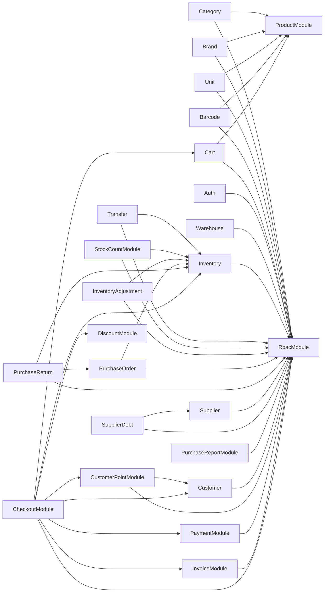

# Architecture Audit — Dependency Graph & Module Inventory

**Prompt A01 — Architecture Audit.** Chỉ phân tích, không sửa code. Dữ liệu dưới đây được xác nhận trực tiếp từ mã nguồn hiện tại (`git log` → `a281c6b`), không suy đoán: đọc toàn bộ 25 file `*.module.ts`, đối chiếu 60 model trong `schema.prisma`, grep cross-module Prisma access, grep `forwardRef` toàn repo.

---

## 1. Tổng quan

| Chỉ số | Số lượng |
|---|---|
| Module NestJS đã đăng ký trong `AppModule` | **25** |
| Model Prisma trong `schema.prisma` | **60** |
| Model có module quản lý (CRUD/API) | **~40** |
| Model tồn tại nhưng **chưa có module nào** | **~17** (mục 4) |
| Circular dependency giữa các module (`forwardRef`) | **0** — không tìm thấy |
| Module ghi trực tiếp vào bảng do module khác sở hữu | **0** — đã khắc phục ở T004 (mục 5.1, ban đầu phát hiện 5, mức HIGH) |

Toàn bộ 25 module đều tuân theo layering `domain/application/infrastructure/presentation` (Clean Architecture), trừ 2 ngoại lệ **có chủ đích, đã disclose khi xây**:
- `discount/` — không có `presentation/` (Internal Service, Prompt 034, không public API).
- `platform/` — không theo layout 4 lớp vì là hạ tầng dùng chung (`audit-log/`, `events/`), không phải 1 bounded context nghiệp vụ.

## 2. Danh sách module đã hoàn thành

| Module | Prisma model chính sở hữu | Ghi chú |
|---|---|---|
| `auth` | `User` (partial — chỉ password/session), `Session` | Không có endpoint đăng ký User/Organization |
| `rbac` | `Role`, `Permission`, `RolePermission`, `UserRole` | |
| `product` | `Product`, `ProductPrice`, `ProductImage` | |
| `category` | `Category` | |
| `brand` | `Brand` | |
| `unit` | `Unit` | |
| `barcode` | `Barcode` | |
| `warehouse` | `Warehouse` | |
| `inventory` | `Inventory`, `InventoryMovement` | Xem mục 5.1 — bị 5 module khác ghi trực tiếp |
| `transfer` | `Transfer`, `TransferItem` | |
| `stock-count` | `StockCount`, `StockCountItem` | |
| `inventory-adjustment` | `InventoryAdjustment`, `InventoryAdjustmentItem` | |
| `supplier` | `Supplier`, `SupplierProduct` | |
| `purchase-order` | `PurchaseOrder`, `PurchaseItem` | |
| `purchase-return` | `PurchaseReturn`, `PurchaseReturnItem` | |
| `supplier-debt` | *(không có bảng riêng)* | Đọc/ghi `Debt`+`Payment` (sổ cái dùng chung, xem 5.2) |
| `purchase-report` | *(không có bảng riêng)* | SQL-aggregated, đọc nhiều bảng |
| `customer` | `Customer` | |
| `customer-point` | `CustomerPointLedger` | |
| `cart` | *(Redis, không map bảng nào)* | |
| `discount` | *(không có bảng)* | Internal Service — Strategy Pattern |
| `payment` | *(không có bảng riêng)* | Ghi `Payment` direction IN (sổ cái dùng chung, xem 5.2) |
| `invoice` | `Invoice`, `InvoiceItem` | `orderId` optional — chưa có Order Module |
| `checkout` | *(orchestrator)* | Đọc `Voucher` nội bộ (không public), xem 5.3 |

## 3. Dependency Graph (giữa các module NestJS)

Trích xuất trực tiếp từ `imports: [...]` của từng `*.module.ts`. **Không có `forwardRef` nào trong toàn repo** → đồ thị dưới đây là DAG thật (không có phụ thuộc vòng), NestJS không cần giải quyết circular injection ở bất kỳ đâu.

**Nhận xét:**
- `RbacModule` là root chung của gần như mọi module (permission guard) — không export gì ngoài `RbacService`/`PermissionsGuard`, an toàn.
- `ProductModule` là "hub" cho Category/Brand/Unit/Barcode/Cart — cả 5 module này chỉ import để lấy `PRODUCT_REPOSITORY` (đọc), không có vòng lặp ngược.
- `CheckoutModule` (Prompt 035) là module có **bậc phụ thuộc sâu nhất** (7 module con) — đúng vai trò orchestrator được giao, nhưng cũng là điểm cần chú ý nhất nếu sau này thêm phụ thuộc mới (rủi ro phình to "God Module").
- `DiscountModule` và `PurchaseReportModule` không phụ thuộc `RbacModule`/module nghiệp vụ nào khác — đúng thiết kế (Discount: internal-only, không cần permission; PurchaseReport: chỉ đọc qua Prisma trực tiếp, không qua repository của module khác).
- **Cập nhật T004**: `InventoryModule` nay là hub thứ hai của đồ thị (6 module phụ thuộc: `Checkout`, `Transfer`, `StockCount`, `InventoryAdjustment`, `PurchaseOrder`, `PurchaseReturn`) — hệ quả trực tiếp của việc tập trung hóa đường ghi tồn kho (mục 5.1). Vẫn là DAG thật, không có `forwardRef` mới nào phát sinh (`InventoryModule` chỉ phụ thuộc `RbacModule`, không phụ thuộc ngược lại bất kỳ module nào trong 6 module trên).

## 4. Module còn thiếu (bảng đã có, chưa có module)

Xác nhận bằng 2 nguồn độc lập: (a) model tồn tại trong `schema.prisma` nhưng **0 file `.ts` non-spec nào** trong `src/modules/` tham chiếu đến, (b) `permission-catalog.ts` đã seed sẵn permission cho nhóm đó từ Foundation nhưng chưa có `@Controller` nào dùng.

| Nhóm | Model Prisma | Permission đã seed sẵn (chưa dùng) | Ưu tiên gợi ý |
|---|---|---|---|
| **Organization** | `Organization` | *(không có — chưa từng seed)* | Cao — không có cách tạo tenant mới qua API |
| **Branch** | `Branch` | `branch:*` (crud) | Cao — mọi module khác đều có `branchId` bắt buộc nhưng không ai tạo được Branch qua API |
| **User (CRUD/mời nhân viên)** | `User` | `user:*` (crud) | Cao — chỉ có login/logout, không có tạo/sửa/khóa nhân viên |
| **Setting** | `Setting` | `setting:view`, `setting:update` | Trung bình — `inventory.allowNegativeStock` chỉ có thể set bằng tay trong DB |
| **Tax** | `Tax` | *(không có — chưa từng seed)* | Thấp — `Product.vat` hiện là snapshot số, không FK tới `Tax` |
| **CustomerGroup** | `CustomerGroup` | *(không có — chưa từng seed)* | Thấp — `Customer.customerType` (enum) đang thay thế tạm |
| **Order** | `Order`, `OrderItem` | `order:*` | Cao (Volume 11 theo kế hoạch) |
| **Return (bán hàng)** | `Return`, `ReturnItem` | *(không có — khác `purchase_return` đã dùng)* | Trung bình |
| **Customer Debt** | `Debt` (phía customerId) | `debt:view` | Trung bình — `Debt` đã có phía Supplier (`supplier-debt`), phía Customer chưa có module đọc |
| **Promotion** | `Promotion`, `PromotionCondition` | `promotion:*` | Cao (chặn Discount Engine tự động áp Promotion — đã disclose ở báo cáo Prompt 034) |
| **Voucher (CRUD đầy đủ)** | `Voucher` | `voucher:*` | Cao — hiện chỉ có repository đọc nội bộ trong `checkout/`, không ai tạo/sửa Voucher được |
| **CashBook** | `CashBook` | `cashbook:*` | Trung bình |
| **Expense** | `ExpenseCategory`, `Expense` | `expense:*` | Thấp |
| **Delivery/Shipment** | `Delivery`, `Shipment` | `delivery:*` | Thấp (phụ thuộc Order trước) |
| **Notification** | `Notification` | `notification:view` | Thấp |
| **File** | `File` | `file:*` | Thấp |
| **Webhook** | `Webhook`, `WebhookLog` | `webhook:*` | Thấp |
| **ApiKey** | `ApiKey` | *(không có — chưa từng seed)* | Thấp |

`PriceHistory` và `Sequence` **không tính là gap** — `PriceHistory` do `product` module tự ghi nội bộ khi đổi giá; `Sequence` là bảng hạ tầng dùng chung cho mọi code generator (đúng thiết kế, không "thuộc về" module nào).

## 5. Module tham chiếu trực tiếp DB của module khác

### 5.1 — HIGH: 5 module ghi trực tiếp vào `Inventory`/`InventoryMovement`, bỏ qua `IInventoryRepository`

`IInventoryRepository.recordMovement()` tự ghi chú rõ: *"Không có API/DTO tạo trực tiếp — các module nghiệp vụ tương lai (Purchase, POS, Transfer, Stock Count, Adjustment) gọi hàm này qua INVENTORY_REPOSITORY."* Thực tế grep xác nhận **KHÔNG module nào trong 5 module dưới đây import `InventoryModule`** — mỗi module tự có `Prisma.TransactionClient` riêng và tự viết `tx.inventory.upsert()`/`tx.inventoryMovement.create()` trong chính repository của mình:

| Module | File | Cách xử lý |
|---|---|---|
| `purchase-order` | `prisma-purchase-order.repository.ts` | Tự tính Average Cost + ghi Inventory/Movement khi Receive |
| `purchase-return` | `prisma-purchase-return.repository.ts` | Tự ghi khi Approve, tự đọc setting `allowNegativeStock` |
| `transfer` | `prisma-transfer.repository.ts` | Tự ghi 2 lần (xuất kho nguồn, nhập kho đích) |
| `stock-count` | `prisma-stock-count.repository.ts` | Tự ghi khi Complete (điều chỉnh theo số đếm thực tế) |
| `inventory-adjustment` | `prisma-inventory-adjustment.repository.ts` | Tự ghi khi Complete |

Có 1 hàm dùng chung `applyInventoryDelta()` (`common/utils/average-cost.util.ts`) để tránh trùng lặp CÔNG THỨC Average Cost — nhưng đây chỉ là 1 pure function, không phải cơ chế gate-kept qua repository interface. **Đối lập trực tiếp**: `checkout` module (Prompt 035, mới nhất) làm ĐÚNG theo doc-comment của `IInventoryRepository` — import `InventoryModule`, gọi `recordSaleMovement()` qua `INVENTORY_REPOSITORY`.

**Vì sao đáng chú ý**: đây là lý do kỹ thuật thực sự khiến `recordSaleMovement()` (Optimistic Lock, Prompt 035) chỉ bảo vệ được các giao dịch đi qua Checkout — 5 module kia vẫn dùng cơ chế `upsert()` không khóa của `recordMovement()`/tự viết, nên vẫn còn nguyên rủi ro race condition nếu, ví dụ, một Purchase Order Receive và một Checkout cùng lúc động vào cùng 1 dòng Inventory.

> **Đã khắc phục — T004 (Inventory Refactor, SPEC-INV-001).** Cả 5 module trên (cộng cả `checkout`, refactor tối thiểu tầng DI) nay gọi qua `InventoryDomainService` (cửa ngõ ghi duy nhất, export bởi `InventoryModule` — `IInventoryRepository` lùi thành chi tiết nội bộ, không còn export). Optimistic Lock đã tổng quát hóa cho MỌI `movementType`, không chỉ SALE. Xác nhận bằng grep toàn `backend/src`: đúng 1 file (`prisma-inventory.repository.ts`, trong chính `inventory` module) còn gọi `tx.inventory.upsert/update/create` hay `tx.inventoryMovement.create`. Chi tiết đầy đủ: `docs/implementation/sprint-00-t004-report.md`.

### 5.2 — Chấp nhận được (disclosed pattern, nhất quán): sổ cái dùng chung `Debt`/`Payment`

`purchase-order`/`purchase-return` ghi thẳng `tx.debt.create()`; `supplier-debt` VÀ `payment` (module mới, Prompt 035) đều ghi thẳng `tx.payment.create()`. Đây là pattern **đã được thiết kế có chủ đích** từ Prompt 029 (comment trong code: *"Debt đã là sổ cái ghi-thêm dùng chung... Payment (Foundation) là sổ cái các khoản đã chi"*) — không có "Debt Module"/"Payment Module" nào sở hữu độc quyền các bảng này, mọi module nghiệp vụ được phép APPEND (không update/delete) vào sổ cái chung. Khác về bản chất với mục 5.1: ở đây có sự đồng thuận thiết kế rõ ràng, không phải bỏ qua 1 repository interface đã tồn tại.

### 5.3 — LOW: đọc (read-only), không phải ghi

- `warehouse` module đọc `Inventory`/`InventoryMovement` (không qua `IInventoryRepository`) chỉ để kiểm tra "kho có tồn kho/lịch sử không" trước khi cho xóa (`hasStockOrTransactions()`). Không có write.
- `checkout` module tự có `IVoucherRepository` nội bộ đọc/ghi bảng `vouchers` — đã disclose rõ trong báo cáo Prompt 035 là "không phải Voucher Module đầy đủ", chỉ 2 method tối thiểu.

## 6. Kết luận (chỉ nêu sự kiện, không đề xuất sửa — đúng yêu cầu "Không được sửa code")

1. **Không có circular dependency nào** giữa 25 module hiện có.
2. **Kiến trúc Clean Architecture được tuân thủ nhất quán** (layer-by-layer) trên toàn bộ 25 module.
3. **Có 1 điểm không nhất quán kiến trúc rõ ràng**: 5 module (Purchase Order/Purchase Return/Transfer/Stock Count/Inventory Adjustment — tất cả xây trước Prompt 031) ghi trực tiếp vào bảng `Inventory`/`InventoryMovement` thay vì qua `IInventoryRepository`, trong khi module mới nhất (`checkout`, Prompt 035) tuân thủ đúng. Đây là gap giữa "kiến trúc cũ" (trước quy tắc "không gọi chéo/ghi chéo module" có hiệu lực từ Prompt 031) và "kiến trúc mới".
4. **~17 model đã có sẵn trong schema nhưng chưa có module nào quản lý** — trong đó **Organization và Branch** là nghiêm trọng nhất vì không có bảng nào khác hoạt động được nếu không có tenant/chi nhánh (hiện chỉ tạo được qua thao tác tay/`prisma.upsert()` trong test).
5. Sổ cái dùng chung (`Debt`, `Payment`) là pattern nhất quán, có chủ đích, không phải lỗi kiến trúc.
