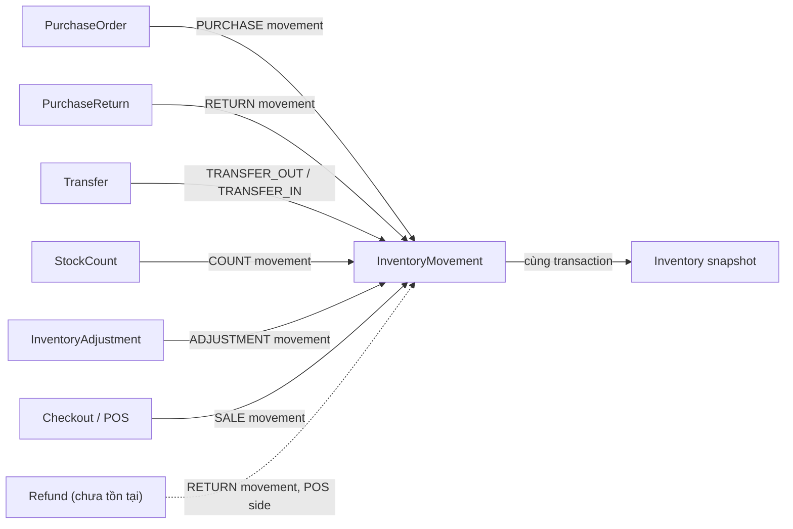

# Inventory Domain Model

> **T003.5 — Inventory Architecture Specification & Review.** Tài liệu phân tích/thiết kế. Không sửa code, không tạo migration. Nội dung dưới đây là **đề xuất** làm đầu vào cho `SPEC-INV-001` do user soạn — chưa phải quyết định cuối cùng. Mọi điểm đánh dấu **[OPEN QUESTION]** cần SPEC-INV-001 quyết định trước khi T004 code.

## 1. Bối cảnh

Prompt A01 (`docs/architecture/dependency-graph.md`) phát hiện 5 module (`purchase-order`, `purchase-return`, `transfer`, `stock-count`, `inventory-adjustment`) ghi trực tiếp vào bảng `inventories`/`inventory_movements`, bỏ qua `IInventoryRepository` — dù interface đó tự nhận là "sole write path". T003.5 xác định kiến trúc Target trước khi T004 refactor 5 module này.

Tài liệu này liệt kê **Aggregate hiện có**, **Aggregate được đề cập trong yêu cầu nhưng CHƯA tồn tại**, và ranh giới Aggregate boundary đúng theo DDD.

## 2. Bảng tổng hợp Aggregate

| Aggregate (theo yêu cầu SPEC) | Tồn tại trong schema? | Model Prisma hiện có | Ai ghi hôm nay | Ghi chú |
|---|---|---|---|---|
| **Inventory** | ✅ Có | `Inventory` (`inventories`) | 6 nơi (xem [[inventory-write-path]]) | Snapshot đọc nhanh per (warehouseId, productId) |
| **InventorySnapshot** | ❌ Không tồn tại như model riêng | — | — | Xem §4.1 — hiện `Inventory` chính LÀ snapshot, không có bảng snapshot tách biệt |
| **InventoryMovement** | ✅ Có | `InventoryMovement` (`inventory_movements`) | Cùng 6 nơi, luôn cùng transaction với ghi `Inventory` | Ledger bất biến (append-only), là Source of Truth |
| **InventoryReservation** | ❌ Không tồn tại | Field `Inventory.reservedQty` tồn tại nhưng **không nơi nào từng ghi vào nó** ngoài giá trị khởi tạo `0` | Không ai | Xem §4.2 — cần SPEC riêng |
| **InventoryAdjustment** | ✅ Có (aggregate độc lập, không phải con của Inventory) | `InventoryAdjustment` + `InventoryAdjustmentItem` | `inventory-adjustment` module | Aggregate riêng, tạo ra Movement type `ADJUSTMENT` |
| **InventoryTransfer** | ✅ Có (tên model là `Transfer`, không phải `InventoryTransfer`) | `Transfer` + `TransferItem` | `transfer` module | Aggregate riêng, tạo Movement type `TRANSFER_OUT`/`TRANSFER_IN` |
| **StockCount** | ✅ Có | `StockCount` + `StockCountItem` | `stock-count` module | Aggregate riêng, tạo Movement type `COUNT` |
| **Lot** | ❌ Không tồn tại | — | — | Xem §4.3 |
| **Serial** | ❌ Không tồn tại | — | — | Xem §4.3 |
| **Batch** | ❌ Không tồn tại | — | — | Xem §4.3 |

**Kết luận quan trọng:** trong 10 khái niệm SPEC yêu cầu xác định, chỉ **5 tồn tại thật** trong schema hôm nay (`Inventory`, `InventoryMovement`, `InventoryAdjustment`, `Transfer`, `StockCount`). `InventoryReservation`, `Lot`, `Serial`, `Batch` là 4 khoảng trống hoàn toàn — không có schema, không có code. `InventorySnapshot` là tên gọi trong yêu cầu nhưng ánh xạ vào chính `Inventory` hiện tại, không phải một bảng riêng.

## 3. Ranh giới Aggregate đúng (DDD)

### 3.1 `Inventory` và `InventoryMovement` là HAI Aggregate riêng, không phải quan hệ cha-con

Về mặt DDD thuần túy, `InventoryMovement` **không phải** là entity con nằm trong Aggregate `Inventory` — không có nơi nào load "Inventory kèm toàn bộ Movement" như một consistency boundary (sẽ phình vô hạn theo thời gian, sai nguyên tắc Aggregate nhỏ). Thay vào đó:

- **`Inventory`** — Aggregate Root độc lập. Bất biến nghiệp vụ: `quantity`/`avgCost`/`lastCost` chỉ được thay đổi thông qua đúng MỘT hàm ghi (xem [[inventory-write-path]]). Unique key `(warehouseId, productId)` — granularity hiện tại là kho×sản phẩm, KHÔNG có chiều lô/serial.
- **`InventoryMovement`** — Aggregate Root độc lập dạng Ledger (append-only, không có `updatedAt`/`deletedAt` — đã ghi là không sửa/xóa, sai sót sửa bằng dòng bù trừ mới). Đây là **Source of Truth**; `Inventory` là **projection suy ra được** (derived, rebuildable) từ tổng các `InventoryMovement`.

Hai Aggregate này được giữ nhất quán với nhau **không phải bằng object containment**, mà bằng một **bất biến giao dịch** do tầng ghi (Domain Service/Repository write path) đảm bảo: mọi lần ghi `InventoryMovement` PHẢI đi kèm đúng một lần cập nhật `Inventory` tương ứng, trong cùng 1 transaction DB. Đây là quy tắc đã được tuân thủ đúng trong code hiện tại ở cả 6 nơi ghi — nhưng bị lặp lại thủ công 6 lần thay vì tập trung ở 1 nơi.

### 3.2 Các Aggregate "nguồn phát sinh biến động" (Movement-Source Aggregates)

`PurchaseOrder`, `PurchaseReturn`, `Transfer`, `StockCount`, `InventoryAdjustment` — và tương lai `Checkout`/`Refund` — là các Aggregate **độc lập, không phải sub-aggregate của Inventory**. Mỗi cái sở hữu vòng đời/status workflow riêng (DRAFT→APPROVED→RECEIVED, v.v.) và có trách nhiệm gọi đúng vào write path của Inventory khi status chuyển sang trạng thái "đã xảy ra thật" (received/completed/approved). Chúng phụ thuộc vào Inventory, nhưng Inventory không biết gì về chúng (đúng hướng phụ thuộc một chiều).

## 4. Ba khoảng trống cần SPEC-INV-001 quyết định

### 4.1 `InventorySnapshot` — có cần tách khỏi `Inventory` không?

Hiện tại `Inventory` vừa là bản ghi sống (live, luôn cập nhật) vừa đóng vai trò "snapshot đọc nhanh" mà comment trong schema mô tả. Nếu nghiệp vụ tương lai cần **snapshot đóng băng theo kỳ** (ví dụ: tồn kho cuối tháng để tính giá vốn hàng bán/report kế toán, không đổi dù có nghiệp vụ phát sinh sau đó), đó là một Aggregate THỰC SỰ khác — bất biến, gắn với một kỳ (period), không phải bản ghi sống. Hai khái niệm không nên dùng chung 1 bảng.

**[OPEN QUESTION]**: Nghiệp vụ có cần period-end snapshot cho kế toán/report không? Nếu có, `InventorySnapshotPeriod` (tên đề xuất) là aggregate mới, độc lập với `Inventory`.

### 4.2 `InventoryReservation` — giữ tồn kho tạm thời

`Inventory.reservedQty` và field suy ra `availableQty = quantity - reservedQty` đã tồn tại trong entity/mapper (`prisma-inventory.repository.ts` dòng `toEntity()`), nhưng **không có bất kỳ write path nào từng thay đổi `reservedQty` khỏi giá trị khởi tạo 0**. Đây là field "khai báo trước, chưa triển khai" — không phải bug, nhưng là tính năng rỗng.

Use case thực tế cần Reservation: giữ hàng khi khách đang thanh toán (giỏ hàng Cart, xem Cart Engine Prompt 033), giữ hàng cho đơn đặt trước, giữ hàng đồng bộ kênh bán online. Không có Reservation nghĩa là hai thu ngân có thể cùng thao tác trên đơn vị tồn kho cuối cùng cho tới tận lúc Checkout commit (xem thêm [[inventory-concurrency]] Case 6).

**[OPEN QUESTION]**: `InventoryReservation` có cần là Aggregate riêng (ledger giữ-chỗ có TTL/expiry, giống `InventoryMovement` nhưng cho "hold" tạm thời chưa phải biến động thật) hay tiếp tục hoãn? Nếu triển khai, cần quyết định: giữ chỗ ở bước nào (thêm vào Cart hay chỉ lúc bắt đầu Checkout), TTL bao lâu, ai giải phóng khi hết hạn.

### 4.3 `Lot` / `Serial` / `Batch` — theo dõi theo lô/serial

Không có schema, không có code, không có model nào tên chứa "Lot"/"Serial"/"Batch" trong toàn bộ `schema.prisma`. `Inventory` hiện chỉ theo dõi ở granularity (warehouseId, productId) — KHÔNG có chiều lô/hạn dùng/số serial.

Đây là thay đổi **phá vỡ grain của Aggregate** nếu triển khai (unique key của `Inventory` sẽ phải mở rộng thành `(warehouseId, productId, lotId?)` hoặc tương tự), ảnh hưởng lan tỏa tới toàn bộ 6 nơi ghi, đến cách tính Average Cost (`applyInventoryDelta` hiện tính theo product, không theo lô), và đến toàn bộ luồng bán hàng (chọn lô nào để xuất — FIFO/FEFO). Đây không phải một field bổ sung nhỏ — là quyết định kiến trúc lớn.

**[OPEN QUESTION]**: Nghiệp vụ có bắt buộc theo dõi hạn dùng (FEFO cho ngành hàng có date) hoặc bảo hành theo serial (điện tử) không? Nếu có, cần SPEC riêng (`SPEC-LOT-001`?) đánh giá tác động lên toàn bộ write path TRƯỚC khi thêm — khuyến nghị không gộp chung vào T004 (T004 chỉ nên di chuyển write path hiện có sang 1 cửa ngõ duy nhất, không mở rộng grain).

## 5. Không tồn tại: `Shift`

Ghi chú kế thừa từ T002/T003: không có khái niệm `Shift` (ca làm việc) ở bất kỳ đâu trong codebase. Điều này liên quan tới Inventory ở chỗ: một số ERP dùng Shift để đóng/khóa kiểm kê theo ca — hiện không thể áp dụng vì chưa có Shift. Không phải lỗi, là khoảng trống đã biết.

## 6. Tổng kết cho SPEC-INV-001

Khi soạn SPEC-INV-001, các quyết định cần đưa ra tương ứng với 3 khoảng trống ở §4, cộng với quyết định về write path ở [[inventory-write-path]], locking ở [[inventory-locking-strategy]], và transaction boundary ở [[inventory-transaction-boundary]]. Tài liệu Migration Plan ([[inventory-migration-plan]]) chỉ đề cập việc di chuyển 5 module hiện có sang 1 cửa ngõ ghi duy nhất — KHÔNG bao gồm việc xây `InventoryReservation`/`Lot`/`Serial`/`Batch`/snapshot theo kỳ, các mục đó cần SPEC riêng sau này.
