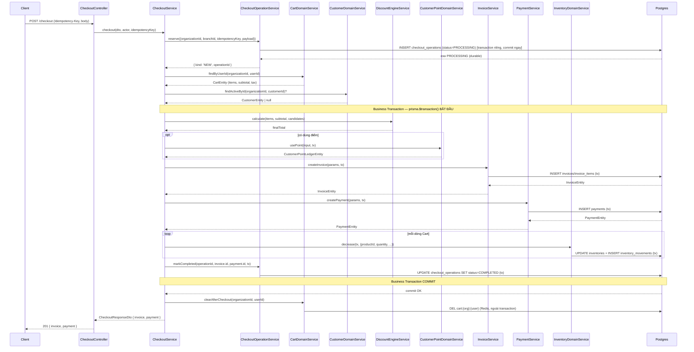

# Implementation Plan — T013 Sales Foundation

**Trạng thái:** Chờ Plan Review. **Không code, không sửa Prisma schema, không tạo/chạy migration, không commit, không push, không tag, không implementation** ở bước này — chỉ kế hoạch (Decision AD06 — Type A).
**Nguồn:** `SPEC-T013-SALES-FOUNDATION-001` v2 (cập nhật theo Decision SP01-SP12 + AD07, bổ sung Retry Policy/FAILED Recovery theo yêu cầu mới nhất của Architect).

---

## 1. Implementation Objectives

1. Bổ sung Idempotency thật sự chịu được crash/timeout cho `POST /checkout` — mục tiêu quan trọng nhất, xuất phát từ "lỗ hổng kiến trúc nghiêm trọng nhất" (AR11).
2. Sửa 4 Repository Boundary violation tồn tại từ trước T013 (`cart`/`invoice`/`payment`/`customer-point`) — không để tái diễn ở module Sales mới.
3. Tích hợp Idempotency + snapshot + SERVICE-product exemption vào `CheckoutService` mà **không** đổi mô hình kiến trúc hiện có (Decision AD07 — Checkout Command Pattern, không CRUD Invoice).
4. Invoice Number dùng đúng `Branch.invoicePrefix` + `SequenceCodeGeneratorService` đã có từ T012 — không tạo generator mới.
5. Invoice/InvoiceItem lưu đủ snapshot bắt buộc (Customer/Product/Unit/giá đã áp dụng) — không để việc sửa Master Data sau này làm thay đổi hóa đơn lịch sử.
6. Đảm bảo Regression Baseline (Sprint-00 → T012) không bị phá vỡ ở bất kỳ Phase nào.
7. CI (`backend-ci.yml`) PASS thật sự sau khi Implementation — không lặp lại tình huống đỏ 3 release liên tiếp (T009/T011/T012).

## 2. Work Breakdown Structure — theo Phase

### Phase 1 — Idempotency

Xây dựng toàn bộ hạ tầng Idempotency (SPEC §9.5, §13):

| File | Loại |
|---|---|
| `backend/prisma/migrations/<ts>_checkout_operations/{migration,rollback}.sql` | Mới — **Migration 1** |
| `backend/src/modules/checkout/domain/repositories/checkout-operation.repository.interface.ts` | Mới |
| `backend/src/modules/checkout/infrastructure/persistence/prisma-checkout-operation.repository.ts` + `.spec.ts` | Mới |
| `backend/src/modules/checkout/application/checkout-operation.service.ts` + `.spec.ts` | Mới |
| `backend/src/modules/checkout/application/checkout-cleanup.processor.ts` + `.spec.ts` | Mới (BullMQ) |
| `backend/src/common/errors/error-codes.ts` | Sửa — thêm `CHECKOUT_IDEMPOTENCY_KEY_MISSING`/`_KEY_REUSED`/`_CONFLICT` |

### Phase 2 — Repository Boundary

Sửa 4 vi phạm đã xác nhận qua Architecture Review (SPEC §9.1-§9.3, §9.6):

| File | Loại |
|---|---|
| `backend/src/modules/cart/application/cart-domain.service.ts` + `.spec.ts` | Mới |
| `backend/src/modules/customer-point/application/customer-point-domain.service.ts` + `.spec.ts` | Mới |
| `backend/src/modules/cart/cart-repository-boundary.architecture.spec.ts` | Mới |
| `backend/src/modules/invoice/invoice-repository-boundary.architecture.spec.ts` | Mới |
| `backend/src/modules/payment/payment-repository-boundary.architecture.spec.ts` | Mới |
| `backend/src/modules/customer-point/customer-point-repository-boundary.architecture.spec.ts` | Mới |
| `backend/src/modules/cart/cart.module.ts` | Sửa — `exports` |
| `backend/src/modules/customer-point/customer-point.module.ts` | Sửa — `exports` |
| `backend/src/modules/invoice/invoice.module.ts` | Sửa — `exports` |
| `backend/src/modules/payment/payment.module.ts` | Sửa — `exports` |

### Phase 3 — Checkout Refactor

Lắp ráp injection mới + luồng Idempotency 2-bước vào `CheckoutService` (SPEC §9.4, §13.2) — **phụ thuộc Phase 1, 2, 4, 5 đã xong**:

| File | Loại |
|---|---|
| `backend/src/modules/checkout/application/checkout.service.ts` + `.spec.ts` | Sửa — injection mới, luồng Bước 1 (Reserve) + Bước 2 (Business Transaction) |
| `backend/src/modules/checkout/presentation/checkout.controller.ts` + `.spec.ts` | Sửa — `@Headers('idempotency-key')` bắt buộc |
| `backend/src/modules/checkout/checkout.module.ts` | Sửa — `imports`/`providers` đầy đủ |

### Phase 4 — Invoice Number

Refactor generator dùng hạ tầng đã chuẩn hóa từ T012 (SPEC §0.10, AR10):

| File | Loại |
|---|---|
| `backend/src/modules/invoice/infrastructure/generators/sequence-invoice-code.generator.ts` + `.spec.ts` | Sửa — dùng `Branch.invoicePrefix` + `SequenceCodeGeneratorService`, `sequenceName` theo `branchId` |

**Migration 3 (invoice numbering) — KHÔNG cần** (đã xác nhận qua SPEC §3.1/§0.10): `Branch.invoicePrefix` đã tồn tại từ trước, không cần cột mới, chỉ đổi code.

### Phase 5 — Snapshot

Bổ sung field snapshot bắt buộc trên Invoice/InvoiceItem (SPEC §1.1-§1.3):

| File | Loại |
|---|---|
| `backend/prisma/migrations/<ts>_invoice_snapshot_fields/{migration,rollback}.sql` | Mới — **Migration 2** |
| `backend/src/modules/invoice/domain/entities/invoice.entity.ts` | Sửa |
| `backend/src/modules/invoice/domain/repositories/invoice.repository.interface.ts` | Sửa |
| `backend/src/modules/invoice/infrastructure/persistence/prisma-invoice.repository.ts` + `.spec.ts` | Sửa |
| `backend/src/modules/invoice/application/invoice.service.ts` + `.spec.ts` | Sửa |
| `backend/src/modules/invoice/application/dto/invoice-response.dto.ts` | Sửa |
| `backend/src/modules/invoice/application/mappers/invoice.mapper.ts` | Sửa |

### Phase 6 — Service Product

Bổ sung invariant "SERVICE product không trừ tồn" vào `CheckoutService` (SPEC §12) — phase riêng dù cùng file với Phase 3, vì đây là 1 business rule độc lập, dễ cô lập review/test/rollback riêng:

| File | Loại |
|---|---|
| `backend/src/modules/checkout/application/checkout.service.ts` | Sửa tiếp (nối sau Phase 3) — thêm check `product.type === 'SERVICE'` trước `InventoryDomainService.decrease()`, xử lý đúng giỏ hàng hỗn hợp |
| `backend/src/modules/checkout/checkout.module.ts` | Sửa tiếp — thêm `imports: [..., ProductModule]` |

### Phase 7 — Regression

| File | Loại |
|---|---|
| Toàn bộ test còn thiếu theo SPEC §15 (network-timeout-retry, expired-key, mixed-cart nếu Phase 6 chưa phủ hết) | Mới/Sửa |
| `docs/release/t013-release-note.md` | Mới |
| `CHANGELOG.md`, `PROJECT_STATUS.md`, `docs/SPRINT_DASHBOARD.md`, `docs/architecture/technical-debt.md` | Sửa |

**Phụ thuộc giữa Phase:** 1, 2, 4, 5 độc lập với nhau, có thể thực hiện theo bất kỳ thứ tự nào trong nhóm này (không phụ thuộc kỹ thuật lẫn nhau). Phase 3 bắt buộc đứng SAU khi 1, 2, 4, 5 đã hoàn tất (vì đây là bước "lắp ráp" cuối, tham chiếu symbol từ cả 4 phase kia). Phase 6 nối tiếp ngay sau Phase 3 (cùng file, thêm 1 business rule). Phase 7 luôn là bước cuối cùng.

## 3. Commit Plan

| # | Commit | Phase | Mục tiêu | Phạm vi | Rollback |
|---|---|---|---|---|---|
| 1 | Migration 1 — `checkout_operations` | 1 | Tạo bảng hỗ trợ Idempotency | `schema.prisma` + 1 file SQL migration/rollback | `DROP TABLE "checkout_operations"` |
| 2 | Idempotency Infrastructure | 1 | Repository + Service + Cleanup Job cho Idempotency | 5 file mới (§2 Phase 1, trừ migration) + error codes | Xóa 5 file mới, revert `error-codes.ts` — không ảnh hưởng module khác (chưa có consumer) |
| 3 | Repository Boundary Fix | 2 | Sửa 4 vi phạm ADR-0010 | 6 file mới (2 Domain Service + 4 Architecture Test) + 4 file `exports` sửa | Revert 4 dòng `exports` về cũ; xóa 6 file mới — không ảnh hưởng vì chưa có consumer mới nào dùng (Checkout chưa đổi ở bước này) |
| 4 | Invoice Number Generator | 4 | Dùng `Branch.invoicePrefix` + `SequenceCodeGeneratorService` | 1 file sửa + spec | Revert về hardcode `'HD'` như cũ — không ảnh hưởng dữ liệu (chỉ đổi cách sinh mã tương lai) |
| 5 | Migration 2 — Invoice Snapshot | 5 | Thêm cột snapshot | `schema.prisma` + 1 file SQL migration/rollback | `ALTER TABLE ... DROP COLUMN` từng cột (liệt kê đủ ở SPEC §19) |
| 6 | Invoice Domain Layer — Snapshot | 5 | Entity/Repository/Service/DTO/Mapper ghi + đọc snapshot | 6 file sửa (§2 Phase 5, trừ migration) | Revert từng file — Migration 2 vẫn giữ (cột nullable, không bắt buộc dùng ngay) |
| 7 | Checkout Refactor | 3 | Tích hợp injection mới + luồng Idempotency 2-bước | 3 file sửa (Service/Controller/Module) | Revert `checkout.service.ts`/`checkout.controller.ts`/`checkout.module.ts` về bản trước Commit 7 — đây là điểm rollback rủi ro nhất, phải test kỹ trước khi merge (xem §8 Risk Checkpoints) |
| 8 | Service Product Exemption | 6 | Không trừ tồn cho Product SERVICE, xử lý mixed cart | Tiếp tục sửa `checkout.service.ts`/`checkout.module.ts` (nối Commit 7) | Revert riêng đoạn check `product.type` — tách biệt được vì đây là 1 khối logic độc lập trong cùng method |
| 9 | Tests bổ sung | 7 | Phủ hết test còn thiếu SPEC §15 | Test file các loại | Không ảnh hưởng code sản xuất |
| 10 | Documentation | 7 | Release note, CHANGELOG, PROJECT_STATUS, SPRINT_DASHBOARD, technical-debt | 5 file tài liệu | Không ảnh hưởng code |

## 4. Migration Order

| # | Migration | Nội dung | Phase |
|---|---|---|---|
| **1** | `checkout_operations` | Bảng mới cho Idempotency (SPEC §3.2) | Phase 1 |
| **2** | Invoice snapshot fields | Cột mới trên `invoices`/`invoice_items` (SPEC §3.1) | Phase 5 |
| **3** | Invoice numbering | **Không cần** — `Branch.invoicePrefix` đã tồn tại từ trước, chỉ đổi code ở Phase 4, không có migration số 3 nào được tạo | Phase 4 |

Cả 2 migration thật (1, 2) độc lập hoàn toàn, không transaction chung, mỗi cái có `rollback.sql` riêng, không `DROP` dữ liệu nghiệp vụ nào.

## 5. Verification Gates (theo từng Phase)

| Sau Phase | Build | Typecheck | Lint | Unit Test | Integration Test | Architecture Test |
|---|---|---|---|---|---|---|
| 1 — Idempotency | ✅ | ✅ | ✅ | ✅ (`checkout-operation.service.spec.ts`, `checkout-cleanup.processor.spec.ts`, `prisma-checkout-operation.repository.spec.ts`) | PENDING — cần Docker/Postgres cho test race-condition thật với 2 connection đồng thời; unit test dùng mock để mô phỏng | Không áp dụng ở Phase này (chưa có Architecture Test riêng cho `checkout`, sẽ có ở Phase 3) |
| 2 — Repository Boundary | ✅ | ✅ | ✅ | ✅ (`cart-domain.service.spec.ts`, `customer-point-domain.service.spec.ts`) | Không áp dụng | ✅ **bắt buộc** — 4 file Architecture Test mới phải PASS trước khi sang Phase 3 |
| 3 — Checkout Refactor | ✅ | ✅ | ✅ | ✅ (`checkout.service.spec.ts` đầy đủ — bao gồm test Idempotency #3-6 SPEC §15) | PENDING — cần Docker cho test concurrency thật (2 request đồng thời) | ✅ — xác nhận `checkout.service.ts` không còn `CART_REPOSITORY`/`CUSTOMER_POINT_REPOSITORY` |
| 4 — Invoice Number | ✅ | ✅ | ✅ | ✅ (Regression Test xác nhận không đổi hành vi nếu `invoicePrefix` null) | Không áp dụng | Không áp dụng |
| 5 — Snapshot | ✅ | ✅ | ✅ | ✅ (test snapshot không đổi khi Product/Customer sửa sau) | PENDING — cần Docker để chạy migration thật trên dữ liệu mẫu | Không áp dụng |
| 6 — Service Product | ✅ | ✅ | ✅ | ✅ (test SERVICE product + mixed cart, SPEC §15 #10-11) | Không áp dụng | Không áp dụng |
| 7 — Regression | ✅ | ✅ | ✅ | ✅ Full `npx jest` — toàn bộ Sprint-00 → T013 | PENDING (cùng nhóm Technical Debt #1 đã có) | ✅ — toàn bộ 4 Architecture Test T013 + các Architecture Test module trước vẫn PASS |

**Nguyên tắc bắt buộc:** không sang Phase kế tiếp nếu Phase hiện tại chưa PASS đủ cột Build/Typecheck/Lint/Unit Test (Integration Test PENDING do thiếu Docker là ngoại lệ đã biết, không chặn tiến độ — đúng tiền lệ toàn dự án).

## 6. Regression Strategy

| Module | Chiến lược |
|---|---|
| **Checkout** | Test suite hiện có (16 `it()`) phải PASS nguyên trạng SAU Phase 3 — không được để injection mới làm vỡ test cũ (mock lại `CartDomainService`/`CustomerPointDomainService` thay vì `ICartRepository`/`ICustomerPointRepository` trực tiếp trong spec) |
| **Invoice** | Test hiện có (`invoice.service.spec.ts`, `prisma-invoice.repository.spec.ts`, generator spec) PASS sau Phase 4/5 — bổ sung test mới cho snapshot, không xóa test cũ |
| **Payment** | Không đổi logic — chỉ xác nhận `payment.module.ts` export fix không phá test nào (Phase 2) |
| **Inventory** | Không đổi code Inventory (AR06 — "đã đúng, không sửa") — chỉ xác nhận `InventoryDomainService.decrease()` vẫn được gọi đúng cho non-SERVICE product sau Phase 6 |
| **Customer Point** | Test hiện có PASS sau Phase 2 (đổi từ mock repository sang mock `CustomerPointDomainService` trong `checkout.service.spec.ts`) |
| **Voucher** | Không đổi `VoucherRepository`/`VoucherEntity` (nội bộ module `checkout`, không vi phạm boundary) — chỉ xác nhận luồng áp voucher vẫn đúng trong Bước 2 (Business Transaction) sau khi tách khỏi Bước 1 (Reserve) ở Phase 3 |

Full Regression Baseline (`npx jest`, toàn bộ Sprint-00 → T012, 157 suite/1525 test hiện có) phải PASS ở cuối Phase 7 — không có suite nào được phép skip trừ 2 suite flaky đã biết (`argon2-password-hasher.spec.ts` khi chạy song song — xác nhận qua `--runInBand`).

## 7. Rollback Strategy (theo từng Phase)

| Phase | Rollback |
|---|---|
| 1 | Rollback Migration 1 (`DROP TABLE checkout_operations`) + xóa 5 file code mới — an toàn vì chưa có consumer nào (Checkout chưa tích hợp tới Phase 3) |
| 2 | Revert 4 dòng `exports` về cũ + xóa 6 file mới — an toàn vì chưa có consumer mới nào dùng Domain Service (Checkout chưa đổi injection tới Phase 3) |
| 3 | Revert `checkout.service.ts`/`checkout.controller.ts`/`checkout.module.ts` về trạng thái trước Phase 3 — **rủi ro cao nhất**, vì đây là nơi lắp ráp mọi thứ; PHẢI có backup/diff rõ ràng trước khi thực hiện Phase này |
| 4 | Revert generator về hardcode `'HD'` — an toàn tuyệt đối, không ảnh hưởng dữ liệu đã sinh trước đó (mã cũ vẫn hợp lệ, chỉ mã MỚI sinh ra sau rollback mới đổi cách tính prefix) |
| 5 | Rollback Migration 2 (drop cột) + revert Entity/Repository/Service/DTO/Mapper — an toàn vì cột nullable, không có ràng buộc NOT NULL nào bị vi phạm khi xóa |
| 6 | Revert riêng đoạn check `product.type === 'SERVICE'` trong `checkout.service.ts` — tách biệt được, không ảnh hưởng luồng Idempotency/Snapshot đã có ở Phase 3/5 |
| 7 | Không ảnh hưởng code sản xuất — chỉ xóa/sửa test và tài liệu nếu cần |

**Nguyên tắc chung:** nếu phải rollback MỘT Phase, các Phase ĐỘC LẬP khác (1/2/4/5) không bắt buộc rollback theo — chỉ Phase 3/6 (phụ thuộc trực tiếp) mới cần rollback dây chuyền nếu Phase phụ thuộc của nó bị rollback.

## 8. Risk Checkpoints

| # | Technical Risk | Rollback Trigger | Acceptance Trigger |
|---|---|---|---|
| 1 | Race condition ở `tryReclaim()` không được unique constraint bảo vệ đúng (2 request cùng "chiếm lại" 1 row FAILED/PROCESSING-treo cùng lúc) | Test #5 (SPEC §15 — 2 request đồng thời cùng key) FAIL sau Phase 1/3 | Test #5 PASS ổn định qua ít nhất 10 lần chạy lặp lại (loại trừ flaky) |
| 2 | `checkout.service.ts` sau Phase 3 vô tình giữ lại 1 nhánh code cũ vẫn gọi `CART_REPOSITORY`/`CUSTOMER_POINT_REPOSITORY` (sót lại từ Phase 2) | Architecture Test (Phase 2/3, SPEC §9.6) FAIL | Cả 4 Architecture Test PASS + grep thủ công xác nhận 0 kết quả cho 2 token trên trong `checkout.service.ts` |
| 3 | Migration 2 (snapshot) không nullable đúng, gây lỗi khi Insert Invoice thiếu field (nếu code Phase 6 quên truyền snapshot cho 1 nhánh) | Test tạo Invoice không Customer (khách lẻ) FAIL vì thiếu snapshot bắt buộc | Test #14 (SPEC §15 — snapshot Mandatory/Conditional) PASS cho cả trường hợp có/không Customer |
| 4 | Cleanup Job (BullMQ) không đăng ký đúng trong `checkout.module.ts`, không bao giờ chạy | `checkout-cleanup.processor.spec.ts` không thể trigger được job trong test | Job có thể trigger thủ công trong test, xác nhận xóa đúng row hết hạn + chuyển đúng row PROCESSING-treo sang FAILED |
| 5 | Voucher `usedCount` không rollback đúng khi Business Transaction (Bước 2) fail sau bước áp voucher (do tách 2-transaction ở Phase 1/3 làm lộ ra lỗi tiềm ẩn không có ở thiết kế 1-transaction cũ) | Test giả lập fail sau áp voucher — `usedCount` bị tăng dù transaction fail | `usedCount` không đổi sau rollback — xác nhận Bước 2 vẫn là 1 transaction Postgres thật (Voucher/Invoice/Payment/Inventory cùng rollback, KHÔNG bị ảnh hưởng bởi việc Bước 1 đã tách riêng) |
| 6 | GitHub Backend CI đỏ ở Lint (lặp lại đúng lỗi đã xảy ra 3 lần ở T009/T011/T012 — khác biệt `--fix` giữa local và CI) | `npx eslint "{src,test}/**/*.ts"` (KHÔNG `--fix`, đúng lệnh CI) FAIL cục bộ trước khi push | Chạy đúng lệnh CI thật cục bộ PASS trước khi đề xuất Final Release Review — không chỉ chạy `npm run lint` (có `--fix`) rồi giả định |

## 9. Final Acceptance Checklist

- [ ] **RFC**: RFC-T013 v2 không có thay đổi nào chưa qua Architecture Review (AR01-AR18 đã xử lý đủ)
- [ ] **SPEC**: SPEC-T013-SALES-FOUNDATION-001 v2 (SP01-SP12 + Retry Policy/FAILED Recovery mới nhất) không có mục nào còn DRAFT/chưa xử lý
- [ ] **Architecture**: 4 Repository Boundary violation đã sửa, Decision AD07 (Checkout Command Pattern) được tuân thủ — không có route CRUD Invoice nào được tạo
- [ ] **Tests**: toàn bộ 20 nhóm test SPEC §15 PASS, kể cả 3 nhóm mới (network-timeout-retry, PROCESSING recovery, expired key)
- [ ] **Coverage**: module `checkout`/`invoice`/`payment`/`cart`/`customer-point` ≥ 90% statements (branch thấp không chặn Release nếu đã ghi Technical Debt — đúng tiền lệ FR01/FR06)
- [ ] **CI**: GitHub Backend CI (`backend-ci.yml`) PASS toàn bộ 5 step (Lint/Typecheck/Unit test/Prisma validate/Build) trên commit thật — xác nhận qua GitHub Actions run, không chỉ suy đoán từ local
- [ ] **Performance**: **Chưa có SLA/benchmark cụ thể nào được RFC/SPEC định nghĩa cho T013** — không tự đặt ra ngưỡng số liệu. Nếu Architect muốn có tiêu chí performance cụ thể (vd thời gian phản hồi `POST /checkout` dưới X ms với Y sản phẩm trong giỏ), cần bổ sung vào SPEC trước khi đưa vào Acceptance — hiện tại mục này để **PENDING**, cùng nhóm với Query Performance Benchmark (Category, `technical-debt.md` #4), không chặn Release theo đúng tiền lệ đã áp dụng
- [ ] Regression Baseline (Sprint-00 → T012) PASS nguyên trạng
- [ ] Working tree sạch trước khi bắt đầu Phase 1 (đã xác nhận ở Implementation Plan này)

## 10. Phase 3 — Documentation Addendum (Architect Review PH3-minor revisions)

Bổ sung tài liệu theo yêu cầu `ARCHITECT REVIEW — T013 PHASE 3` mục 2 (A/B/C) — **chỉ tài liệu,
không đổi code**, logic đã tồn tại và đã verify PASS ở Implementation Report Phase 3.

### 10.A Sequence Diagram — luồng Checkout thành công (request mới, không phải Replay)



### 10.B Replay Flow — 2 trường hợp cùng Idempotency-Key

**Trường hợp 1 — cùng key, cùng payload (retry hợp lệ sau timeout mạng):**

```
Client → POST /checkout (Idempotency-Key: K, body: B)
           │
           ▼
CheckoutOperationService.reserve()
           │
           ├─ findByKey(org, K) → row tồn tại, status=COMPLETED, requestHash = hash(B)
           │
           ▼
    hash(B) khớp requestHash đã lưu
           │
           ▼
   { kind: 'REPLAY', invoiceId, paymentId }
           │
           ▼
CheckoutService: KHÔNG chạm Cart/Discount/Point/Invoice/Payment/Inventory/Transaction
           │
           ▼
InvoiceService.getById + PaymentService.getById → dựng lại đúng response cũ
           │
           ▼
   Client nhận lại 201 { invoice, payment } — CHÍNH XÁC invoice/payment đã tạo lần trước
```

**Trường hợp 2 — cùng key, payload KHÁC (client gửi nhầm/lỗi client, tái sử dụng key cũ):**

```
Client → POST /checkout (Idempotency-Key: K, body: B')   -- B' ≠ B đã dùng cho K trước đó
           │
           ▼
CheckoutOperationService.reserve()
           │
           ├─ findByKey(org, K) → row tồn tại, status=COMPLETED, requestHash = hash(B)
           │
           ▼
    hash(B') KHÁC requestHash đã lưu
           │
           ▼
   throw ConflictException (CHECKOUT_IDEMPOTENCY_KEY_REUSED)
           │
           ▼
   Client nhận 409 — PHẢI đổi sang 1 Idempotency-Key mới cho giao dịch mới này
```

### 10.C Recovery Flow — PROCESSING bị treo → FAILED → Retry

```
Bước 1 (đã commit riêng, durable): row = PROCESSING, createdAt = T0
           │
           ▼ (server crash / exception không catch được / timeout thật giữa Business Transaction)
Business Transaction KHÔNG BAO GIỜ chạy tới markCompleted()
           │
           ▼
Request mới với CÙNG Idempotency-Key đến tại thời điểm T1
           │
           ├─ T1 - T0 < 2 phút  → row PROCESSING còn "hợp lệ" (có thể vẫn có request khác đang xử lý thật)
           │                       → 409 CHECKOUT_IDEMPOTENCY_CONFLICT (client tự retry sau vài giây)
           │
           └─ T1 - T0 ≥ 2 phút  → coi là "bị treo" (stuck)
                                    │
                                    ▼
                          tryReclaim(): compare-and-swap
                          UPDATE ... SET status=PROCESSING, requestHash=mới, createdAt=T1
                          WHERE id=... AND (status=FAILED OR (status=PROCESSING AND createdAt<T1-2phút))
                                    │
                                    ├─ thành công (count=1) → { kind: 'NEW', operationId } → chạy lại
                                    │                          toàn bộ luồng như request đầu tiên
                                    │
                                    └─ thất bại (count=0, thua race với request khác cũng đang
                                       reclaim đồng thời) → 409 CHECKOUT_IDEMPOTENCY_CONFLICT

Retry Policy tổng quát khi request THẤT BẠI do lỗi nghiệp vụ thật (không phải crash):
  reserve() → NEW → validate/transaction FAIL → catch → markFailed(operationId)
  → row chuyển FAILED NGAY (không cần chờ 2 phút)
  → request tiếp theo với CÙNG key → tryReclaim() thấy FAILED → chiếm lại ngay → NEW → thử lại
```

## Lịch sử quyết định

- **RFC-T013 v2** — AR01-AR18.
- **SPEC-T013-SALES-FOUNDATION-001 v1 → v2** — SP01-SP12 + Decision AD07 (Checkout Command Pattern).
- **SPEC bổ sung Retry Policy/FAILED Recovery** (theo yêu cầu Architect ở vòng review Implementation Plan gần nhất) — làm rõ tường minh 2 chính sách vốn đã ngụ ý trong thiết kế PROCESSING Recovery, nay tách thành mục riêng dễ tham chiếu.
- **Implementation Plan này** (`IMPLEMENTATION-PLAN-T013-SALES-FOUNDATION.md`, thay thế bản nháp phẳng-theo-commit trước đó) — tổ chức lại theo 7 Phase (Idempotency/Repository Boundary/Checkout Refactor/Invoice Number/Snapshot/Service Product/Regression) theo đúng yêu cầu cụ thể của Architect, Migration Order đổi thứ tự (`checkout_operations` trước, snapshot sau — khớp thứ tự Phase 1 trước Phase 5), bổ sung Verification Gate theo Integration Test/Architecture Test riêng từng Phase, Risk Checkpoint dạng technical risk/rollback trigger/acceptance trigger, Final Acceptance Checklist đủ 7 mục yêu cầu (bao gồm Performance — disclose trung thực là chưa có SLA nào được định nghĩa, không tự đặt ra số liệu). Chưa code, chưa migration, chưa commit — chờ `ARCHITECT REVIEW — IMPLEMENTATION-PLAN-T013`.
- **Phase 1 (Idempotency Foundation)** — APPROVED. `checkout_operations` (Migration 1), `CheckoutOperationService`/`ICheckoutOperationRepository`, Architecture Test riêng — coverage 96.34%/90.62%/95.45%/97.33%. Decision AD09 (Stable Infrastructure Baseline) ban hành — `checkout_operations` đóng băng schema/API/Domain Service từ đây.
- **Phase 2 (Repository Boundary Cleanup)** — APPROVED. `CartDomainService`/`CustomerPointDomainService` mới, `InvoiceModule`/`PaymentModule` gỡ export repository, 4 Architecture Test (2 có `it.todo()` chờ Phase 3). Naming deviation (giữ `InvoiceService`/`PaymentService`, không tạo `InvoiceDomainService`/`PaymentDomainService`) đã disclose, Architect không yêu cầu sửa lại. Decision AD10 (Repository Boundary Freeze) ban hành.
- **Phase 3 (Checkout Refactor)** — APPROVED WITH MINOR REVISIONS. `CheckoutService`/`CheckoutController` tích hợp đầy đủ Idempotency 2-bước (Reserve tách transaction riêng, Business Transaction giữ nguyên, `markCompleted`/`markFailed` đúng vị trí), đổi injection sang `CartDomainService`/`CustomerPointDomainService`, un-skip 2 Architecture Test còn lại. Full regression 166/166 suite, 1578/1578 test. Bug tự phát hiện và sửa: `CheckoutController.checkout` thiếu `async` (lỗi ergonomics test, không ảnh hưởng production vì NestJS exception filter vẫn xử lý đúng). Yêu cầu tài liệu bổ sung (Sequence Diagram, Replay Flow 2 trường hợp, Recovery Flow) — đã bổ sung ở §10 (tài liệu, không đổi code). Decision AD11 (Checkout Orchestrator Freeze) ban hành — `CheckoutService` từ nay là Stable Orchestrator, mọi thay đổi kiến trúc orchestration sau này cần RFC mới.
- **Phase 4 (Invoice Number Integration)** — APPROVED. `SequenceInvoiceCodeGenerator` refactor dùng `Branch.invoicePrefix` (fallback "HD") + `SequenceCodeGeneratorService` (T012), sequence branch-scoped (`invoice_code_<branchId>`), không tạo generator mới, không đổi mã hóa đơn cũ, không migration. Full regression 165/166 suite (1 flake Argon2 đã xác minh không liên quan). Decision AD12 (Numbering Policy Freeze) ban hành — mọi document number mới sau này (Sales Return, Purchase Return, Phiếu thu/chi...) phải tái dùng `SequenceCodeGeneratorService`, không viết generator riêng nếu không có RFC mới; 8 generator cũ trước T012 không hồi tố.
- **Phase 5 (Invoice Snapshot)** — APPROVED. Migration A (`20260720000000_invoice_snapshot_fields`) thêm 8 cột nullable (Customer/Product/Unit snapshot + Barcode conditional), không backfill. `CheckoutService` bổ sung lookup Product/Unit trước Business Transaction (không đổi cấu trúc orchestration), ghi snapshot vào `createInvoice()`. Barcode snapshot luôn null (Cart chưa capture nguồn gốc quét — disclosed, ngoài phạm vi Phase 5). Full regression 166/166 suite (fully green). Decision AD13 (Invoice Snapshot Freeze) ban hành — Snapshot là immutable historical record, không sửa sau khi tạo, điều chỉnh tương lai phải qua chứng từ riêng (Adjustment/Credit Note/Return), không vá trực tiếp.
- **Phase 6 (Service Product Support)** — APPROVED. `checkout.service.ts` — vòng lặp Inventory bỏ qua `InventoryDomainService.decrease()` khi `product.type === 'SERVICE'` (tái dùng `productById` từ Phase 5, không gọi lookup mới). Hóa đơn hỗn hợp STOCK+SERVICE xác nhận đúng qua test. Full regression 166/166 suite (fully green). Decision AD14 (Product Type Policy Freeze) ban hành — STOCK/SERVICE là 2 loại chính thức, logic Inventory chỉ áp dụng Product cần quản lý tồn kho, loại Product mới trong tương lai phải qua RFC riêng.
- **Phase 7 (Final Regression & Release Readiness)** — APPROVED. Verification-only (0 dòng code mới): typecheck/lint/prisma validate/build đều clean, full regression 166/166 suite chạy lại 2 lần (fully green cả 2 lần), cross-check thủ công 5 Repository Boundary token (grep toàn repo, 0 vi phạm), Release Readiness Checklist đủ 7/7 mục PASS. Decision AD15 (T013 Architecture Baseline) + AD16 (Release Governance) ban hành.
- **T013 — COMPLETED ở cấp độ kiến trúc.** Toàn bộ 7 Phase + RFC + SPEC + Implementation Plan đã APPROVED. Trạng thái: **Ready for Release Preparation** (rà soát changelog/release note/version — KHÔNG phải ủy quyền commit/tag/release, cần một vòng Final Release Review riêng theo AD16 trước khi commit/tag).
